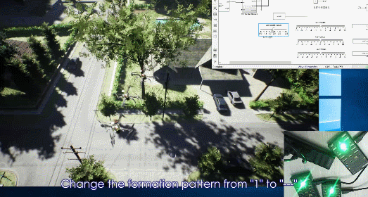

# 第一讲：平台安装与学习方法
## 软件获取及安装
RflySim平台支持在Windows平台下进行一键安装、一键代码生成、一键固件部署、一键软硬件在环仿真和快速实飞,非常方便易用。用户不需要了解飞控源码、Linux编程、C/C++编程、网络通信、飞机组装等底层知识，只需具备基础的Simulink（或Python）知识，即可快速将自己的算法经过层层验证并应用于真机上，有助于更专注于算法的开发与测试。

从官方途径获取最新.iso的镜像（如：免费版是RflySimAdvFree-****.iso，后面****表示版本号），可以鼠标右键-打开方式-Windows资源管理器来加载镜像（或用解压软件解压，或用虚拟光驱加载），从而获取右图所示安装包文件夹，RflySim平台视频版安装教程如下所示，**文字版详细安装步骤请见：**<a target="_blank" href="../HowToInstall.pdf">🔗HowToInstall🔗</a>

<iframe src="//player.bilibili.com/player.html?aid=527851327&bvid=BV1oM411V7XE&cid=1107000290&p=1&autoplay=0" allowfullscreen="allowfullscreen" autoplay="0" width="100%" height=405 scrolling="no" frameborder="0" sandbox="allow-top-navigation allow-same-origin allow-forms allow-scripts"> </iframe>

> 注意：免费版和完整版镜像可以通过填写邮箱的方式，从 https://rflysim.com/download 获取云盘下载链接。完整版下载链接和注册码请咨询service@rflysim.com。我们分享的云盘链接和密码不会变更，但里面的安装包会经常更新，因此以云盘中安装包更新的时间为版本基准。 

## 平台总览

本平台主要根据无人系统开发过程阶段将其划分为10个不同得章节。其内容包括利用RflySim对场景搭建、无人系统的动力学模型建立、底层控制、智能感知、健康评估、网络模拟、集群控制等等。其中第二章关于RflySim平台使用上手，通过该章可以完成软件平台的安装方法和硬件平台配置。通过一二章，读者可以对研究对象和使用工具有个总体的了解，这为后续开发设计打下了基础。在第三、四章中为三维模型与场景开发，以及无人载具系统建模开发，其中前者涉及无人系统工作的环境，后者涉及无人系统的数学模型。基于第三、四章的实践，进入第五、六章中，包含底层控制开发实践涉及如何控制无人系统的动力单元，而远程控制开发实践涉及如何控制无人系统的速度等高层指令。后者涉及的无人系统是“无人系统+自动驾驶仪”的复合系统，其中自动驾仪可以用于控制无人系统的速度。远程控制开发实践多服务于高层决策。在第七章中故障注入与安全测试开发实践内容主要涉及如何设计带故障注入的无人系统模型，以及如何进行故障注入等。这部分工作可以用于测试系统的可靠性和容错能力等等。第八章中讲解了很多智能系统都离不开视觉这一信息量丰富的传感器。视觉算法开发实践内容主要涉及如何接入视觉传感器，并完成视觉输入到控制。第十章中包括集群通信组网开发实践和集群控制开发实践。集群相关工作也可以与单机相关工作进行结合，构建不同场景。<a target="_blank" href="./RflySim_IntroV1.0.pdf">🔗详情见链接🔗</a>
整体框架如下：

#### 更对详细学习资料请见：<a target="_blank" href="../HowToUse.pdf">🔗HowToUse🔗</a>

## RflySim平台各章节简介

| 
**序号** |          
**章节名称**   |                           **简介**                           | 
**配套课件** | 
**API文件** | 
**例程汇总** |
| :------: | :-------------: | :------------------- | :----------: | :-------: | :---------: |
|    1     | 第1讲-绪论 | RflySim平台简介、版本区别、安装及各功能特点。 | <a target="_blank" href="../RflySimAPIs/1.RflySimIntro/PPT.pdf">PPT</a> |     <a target="_blank" href="../RflySimAPIs/1.RflySimIntro/API.pdf">API</a>     |    <a target="_blank" href="../RflySimAPIs/1.RflySimIntro/Readme.pdf">Readme</a>    |
|    2     | 第2讲-实验平台配置        |    RflySim平台配置流程、核心组件的使用方法及实验流程等。     |     <a target="_blank" href="../RflySimAPIs/2.RflySimUsage/PPT.pdf">PPT</a>      |     <a target="_blank" href="../RflySimAPIs/2.RflySimUsage/API.pdf">API</a>     |    <a target="_blank" href="../RflySimAPIs/2.RflySimUsage/Readme.pdf">Readme</a>    |
|    3     | 第3讲-三维场景建模与仿真  | RflySim3D软件的构架和功能、无人系统三维建模与场景开发软件的使用等。 |     <a target="_blank" href="../RflySimAPIs/3.RflySim3DUE/PPT.pdf">PPT</a>      |     <a target="_blank" href="../RflySimAPIs/3.RflySim3DUE/API.pdf">API</a>     |    <a target="_blank" href="../RflySimAPIs/3.RflySim3DUE/Readme.pdf">Readme</a>    |
|    4     | 第4讲-载具运动建模与仿真  |   无人系统载具的控制模型搭建、RflySim平台模型开发流程等。    |     <a target="_blank" href="../RflySimAPIs/4.RflySimModel/PPT.pdf">PPT</a>      |     <a target="_blank" href="../RflySimAPIs/4.RflySimModel/API.pdf">API</a>     |    <a target="_blank" href="../RflySimAPIs/4.RflySimModel/Readme.pdf">Readme</a>    |
|    5     | 第5讲-位姿控制与滤波估计  | 本章包含大量无人系统底层开发例程，提供代码生成与下载功能，可以将设计的Simulink控制算法一键生成PX4固件，并烧录自驾仪中。实现Sim2Real的基础性实验流程。 |     <a target="_blank" href="../RflySimAPIs/5.RflySimFlyCtrl/PPT.pdf">PPT</a>      |     <a target="_blank" href="../RflySimAPIs/5.RflySimFlyCtrl/API.pdf">API</a>     |    <a target="_blank" href="../RflySimAPIs/5.RflySimFlyCtrl/Readme.pdf">Readme</a>    |
|    6     | 第6讲-外部控制与轨迹规划  | 本章通过外部控制接口对智能体发送命令，去实现更上层的轨迹规划等控制功能。 |     <a target="_blank" href="../RflySimAPIs/6.RflySimExtCtrl/PPT.pdf">PPT</a>      |     <a target="_blank" href="../RflySimAPIs/6.RflySimExtCtrl/API.pdf">API</a>     |    <a target="_blank" href="../RflySimAPIs/6.RflySimExtCtrl/Readme.pdf">Readme</a>    |
|    7     | 第7讲-安全测试与健康评估  | 本章针对无人系统开发中的软件单元和集成验证、嵌入式软件和硬件验证、软硬件集成验证到整机集成与测试验证的过程。实现对上述所有的开发阶段进行故障注入与安全测试。 |     <a target="_blank" href="../RflySimAPIs/7.RflySimPHM/PPT.pdf">PPT</a>      |     <a target="_blank" href="../RflySimAPIs/7.RflySimPHM/API.pdf">API</a>     |    <a target="_blank" href="../RflySimAPIs/7.RflySimPHM/Readme.pdf">Readme</a>    |
|    8     | 第8讲-视觉感知与避障决策  | 本章讲述视觉传感器与相关理论，如：载体与各传感器坐标系，视觉控制的常见传感器等；介绍Linux、ROS、MAVROS等相关视觉开发的环境配置方式和RflySim平台的视觉接口。 |     <a target="_blank" href="../RflySimAPIs/8.RflySimVision/PPT.pdf">PPT</a>      |     <a target="_blank" href="../RflySimAPIs/8.RflySimVision/API.pdf">API</a>     |    <a target="_blank" href="../RflySimAPIs/8.RflySimVision/Readme.pdf">Readme</a>    |
|    9     | 第9讲-通信协议与集群组网  | 无人系统组网的方式与现状、RflySim平台中的集群通信的系统架构以及无人系统组网的仿真例程。 |     <a target="_blank" href="../RflySimAPIs/9.RflySimComm/PPT.pdf">PPT</a>     |     <a target="_blank" href="../RflySimAPIs/9.RflySimComm/API.pdf">API</a>     |    <a target="_blank" href="../RflySimAPIs/9.RflySimComm/Readme.pdf">Readme</a>    |
|    10    | 第10讲-集群控制与博弈对抗 | 围绕多智能体的无人系统集群控制开发，介绍了集群编队、任务规划、博弈等技术，重点讲述RflySim平台无人机集群系统的分布式控制框架和基于MATLAB/Python的集群控制接口，提供基于蚂蚁算法的多无人机任务规划、多无人机的编队、曲线管道控制、大规模无人机集群控制等案例，帮助读者理解集群控制的原理和实现方式。 |     <a target="_blank" href="../RflySimAPIs/10.RflySimSwarm/PPT.pdf">PPT</a>      |     <a target="_blank" href="../RflySimAPIs/10.RflySimSwarm/API.pdf">API</a>     |    <a target="_blank" href="../RflySimAPIs/10.RflySimSwarm/Readme.pdf">Readme</a>    |

## RflySim平台特色功能展示

**一键安装** 

**自动代码生成**

**软件在环仿真**

**硬件在环仿真**

**室内飞行控制**

**基于UE4的室内硬件在环仿真**

**基于视觉的一键穿环控制例程**

**带安全防护的真机实验**

**无人车的室外硬件在环仿真场景**

### 
 Simulink控制集群飞机室内飞行实验 

### 
集群控制和硬件在环仿真 

