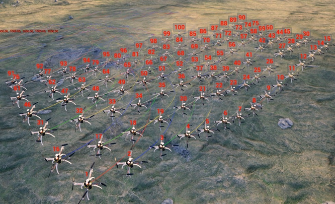
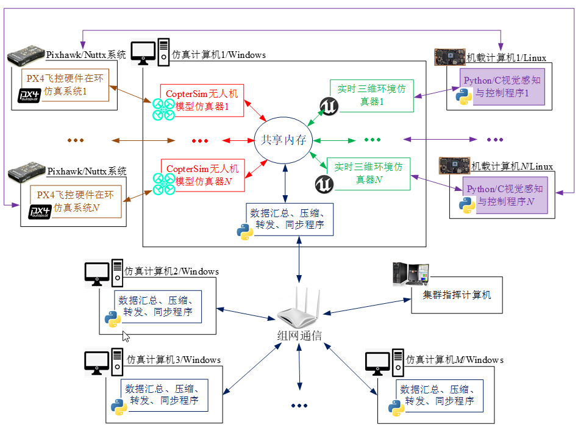

# 10.1、本章使用方法

RflySim支持一键启动多机集群仿真功能，支持MATLAB/Simulink、Python端集群仿真开发，支持多架软件在环、硬件在环及软、硬件相结合的虚实集群仿真，支持局域网内多台电脑的分布式集群仿真。同时，随着飞机数量的增加，网络通信负载越来越大，为了在有限带宽下实现更多数量的无人机集群仿真，需要对通信进行优化，目前平台的数据协议主要有两种：MAVLink数据和UDP压缩结构体，基于这两种数据协议，RflySim提出了5种压缩的数据协议，实现上百架的无人机集群仿真。

同时，该系统借助大规模集群分布式控制仿真系统平台，可实现大规模无人机集群仿真、分布式无人机集群控制研究、分布式无人机集群视觉感知算法验证、无人机飞行控制及通信算法验证等功能。

## 本讲API文件
本讲开发相关API接口平台地址为：<a target="_blank" href="../RflySimAPIs/10.RflySimSwarm/API.pdf">🔗API🔗</a>
## 本讲PPT文件 
本讲内容的PPT文档的平台地址为：<a target="_blank" href="../RflySimAPIs/10.RflySimSwarm/PPT.pdf">🔗PPT🔗</a>
## 本讲所有例程文件
本讲所有例程请见Readme文档，该文件的平台地址为：<a target="_blank" href="../RflySimAPIs/10.RflySimSwarm/Readme.pdf">🔗Readme🔗</a>

| 序号 | 实验名称 | Readme | 最低版本 |
| ---- | ---- | ---- | ---- |
| 1 | SIL仿真Log日志获取实验 | <a target="_blank" href="../RflySimAPIs/10.RflySimSwarm/0.ApiExps\1.SwarmLogGet/Readme.pdf">Readme</a> | 免费版 |
| 2 | MATLAB集群接口模型封装实验 | <a target="_blank" href="../RflySimAPIs/10.RflySimSwarm/0.ApiExps\2.MatRflySwarmAPIPack/Readme.pdf">Readme</a> | 免费版 |
| 3 | .exe文件生成实验 | <a target="_blank" href="../RflySimAPIs/10.RflySimSwarm/0.ApiExps\3.EXEFileGener/Readme.pdf">Readme</a> | 免费版 |
| 4 | 飞控硬件远程重启接口实验 | <a target="_blank" href="../RflySimAPIs/10.RflySimSwarm/0.ApiExps\4.RebootPixViaUDP/Readme.pdf">Readme</a> | 免费版 |
| 5 | 多机地形高度获取接口实验 | <a target="_blank" href="../RflySimAPIs/10.RflySimSwarm/0.ApiExps\5.GetTerrainAPI/Readme.pdf">Readme</a> | 免费版 |
| 6 | 基于Simulink数据分析实验 | <a target="_blank" href="../RflySimAPIs/10.RflySimSwarm/0.ApiExps\6.DataAnalysis_Mat/Readme.pdf">Readme</a> | 免费版 |
| 7 | 基于Python数据分析实验 | <a target="_blank" href="../RflySimAPIs/10.RflySimSwarm/0.ApiExps\7.DataAnalysis_Py/Readme.pdf">Readme</a> | 免费版 |
| 8 | 集群接口实验 | <a target="_blank" href="../RflySimAPIs/10.RflySimSwarm/0.ApiExps\8.MAVLinkFull4Swarm/Readme.pdf">Readme</a> | 免费版 |
| 9 | 通信接口的飞行实验 | <a target="_blank" href="../RflySimAPIs/10.RflySimSwarm/1.BasicExps\e1_RflyUdpSwarmExp/Readme.pdf">Readme</a> | 免费版 |
| 10 | 4机质点集群实验 | <a target="_blank" href="../RflySimAPIs/10.RflySimSwarm/1.BasicExps\e2_NoPX4SITL4Swarm/Readme.pdf">Readme</a> | 免费版 |
| 11 | 集群轨迹灯光展示实验 | <a target="_blank" href="../RflySimAPIs/10.RflySimSwarm/1.BasicExps\e3_LightShowSwarm/Readme.pdf">Readme</a> | 免费版 |
| 12 | 固定翼质点模型集群实验 | <a target="_blank" href="../RflySimAPIs/10.RflySimSwarm/1.BasicExps\e4_FixWingGMSwarm/Readme.pdf">Readme</a> | 免费版 |
| 13 | RflySim3D碰撞接口实验 | <a target="_blank" href="../RflySimAPIs/10.RflySimSwarm/2.AdvExps\e0_AdvApiExps\1.CollisionExpAPI\1.CrashMonitorAPI/Readme.pdf">Readme</a> | 个人版 |
| 14 | MAVLink模式2机碰撞实验 | <a target="_blank" href="../RflySimAPIs/10.RflySimSwarm/2.AdvExps\e0_AdvApiExps\1.CollisionExpAPI\2.CollMAVLinkAPI_Py/Readme.pdf">Readme</a> | 个人版 |
| 15 | UDP模式2机碰撞实验 | <a target="_blank" href="../RflySimAPIs/10.RflySimSwarm/2.AdvExps\e0_AdvApiExps\1.CollisionExpAPI\3.CollUDPModeAPI_Py/Readme.pdf">Readme</a> | 个人版 |
| 16 | UDP模式2机碰撞(Simulink)实验 | <a target="_blank" href="../RflySimAPIs/10.RflySimSwarm/2.AdvExps\e0_AdvApiExps\1.CollisionExpAPI\4.CollUDPModeAPI_Mat/Readme.pdf">Readme</a> | 个人版 |
| 17 | 飞机碰撞实验 | <a target="_blank" href="../RflySimAPIs/10.RflySimSwarm/2.AdvExps\e0_AdvApiExps\1.CollisionExpAPI/Readme.pdf">Readme</a> | 个人版 |
| 18 | 通信接口的UltraSimple模式八机画圆实验 | <a target="_blank" href="../RflySimAPIs/10.RflySimSwarm/2.AdvExps\e1_RflyUdpSwarmAdvExp\1.RflyUdpUltraSimpleEight_Mat/Readme.pdf">Readme</a> | 集合版 |
| 19 | 8机SITL仿真实验 | <a target="_blank" href="../RflySimAPIs/10.RflySimSwarm/2.AdvExps\e1_RflyUdpSwarmAdvExp\2.UDPSimple8Swarm_Py/Readme.pdf">Readme</a> | 集合版 |
| 20 | 分布式局域网点对点通信16机仿真实验 | <a target="_blank" href="../RflySimAPIs/10.RflySimSwarm/2.AdvExps\e1_RflyUdpSwarmAdvExp\3.UDPSimple16Swarm2PC_Py/Readme.pdf">Readme</a> | 集合版 |
| 21 | 单台电脑控制8飞机仿真实验 | <a target="_blank" href="../RflySimAPIs/10.RflySimSwarm/2.AdvExps\e1_RflyUdpSwarmAdvExp/Readme.pdf">Readme</a> | 集合版 |
| 22 | 12机质点集群实验 | <a target="_blank" href="../RflySimAPIs/10.RflySimSwarm/2.AdvExps\e2_NoPX4SITLSwarm\1.NoPX4SITL12Swarm/Readme.pdf">Readme</a> | 集合版 |
| 23 | 30机质点集群实验 | <a target="_blank" href="../RflySimAPIs/10.RflySimSwarm/2.AdvExps\e2_NoPX4SITLSwarm\2.NoPX4SITL30Swarm/Readme.pdf">Readme</a> | 集合版 |
| 24 | 100机质点集群实验 | <a target="_blank" href="../RflySimAPIs/10.RflySimSwarm/2.AdvExps\e2_NoPX4SITLSwarm\3.NoPX4SITL100Swarm/Readme.pdf">Readme</a> | 集合版 |
| 25 | 200机质点集群实验 | <a target="_blank" href="../RflySimAPIs/10.RflySimSwarm/2.AdvExps\e2_NoPX4SITLSwarm\4.NoPX4SITL200Swarm2PC/Readme.pdf">Readme</a> | 集合版 |
| 26 | 多机质点集群实验 | <a target="_blank" href="../RflySimAPIs/10.RflySimSwarm/2.AdvExps\e2_NoPX4SITLSwarm/Readme.pdf">Readme</a> | 集合版 |
| 27 | 分布式局域网广播通信8机仿真实验 | <a target="_blank" href="../RflySimAPIs/10.RflySimSwarm/2.AdvExps\e3_DistributedLANSwarm\1.BroadNetSwarm_Mat/Readme.pdf">Readme</a> | 集合版 |
| 28 | 分布式局域网点对点通信8机仿真实验 | <a target="_blank" href="../RflySimAPIs/10.RflySimSwarm/2.AdvExps\e3_DistributedLANSwarm\2.UseIPNetSwarm_Mat/Readme.pdf">Readme</a> | 集合版 |
| 29 | 分布式局域网通信8机仿真实验 | <a target="_blank" href="../RflySimAPIs/10.RflySimSwarm/2.AdvExps\e3_DistributedLANSwarm/Readme.pdf">Readme</a> | 集合版 |
| 30 | 8机绕“8”字编队飞行仿真实验 | <a target="_blank" href="../RflySimAPIs/10.RflySimSwarm/2.AdvExps\e4_SwarmFormCollCtrl\1.UAV8Swarm3D_Mat/Readme.pdf">Readme</a> | 集合版 |
| 31 | 自动防撞下控制机体速度进行集群编队仿真实验 | <a target="_blank" href="../RflySimAPIs/10.RflySimSwarm/2.AdvExps\e4_SwarmFormCollCtrl\2.SwarmBodyVelCtrlColl_Mat/Readme.pdf">Readme</a> | 集合版 |
| 32 | 自动防撞下控制地球速度(NED坐标系)进行集群编队仿真实验 | <a target="_blank" href="../RflySimAPIs/10.RflySimSwarm/2.AdvExps\e4_SwarmFormCollCtrl\3.SwarmEarthVelCtrlColl_Mat/Readme.pdf">Readme</a> | 集合版 |
| 33 | 自动防撞下控制地球速度(NED坐标系)的集群编队仿真实验(UDP模式) | <a target="_blank" href="../RflySimAPIs/10.RflySimSwarm/2.AdvExps\e4_SwarmFormCollCtrl\4.SwarmEarthVelCtrlCollUdp_Mat/Readme.pdf">Readme</a> | 集合版 |
| 34 | 自动防撞下控制进行集群编队仿真实验 | <a target="_blank" href="../RflySimAPIs/10.RflySimSwarm/2.AdvExps\e4_SwarmFormCollCtrl/Readme.pdf">Readme</a> | 集合版 |
| 35 | 蚂蚁算法多无人机路径规划实验 | <a target="_blank" href="../RflySimAPIs/10.RflySimSwarm/2.AdvExps\e5_AISwarmCtrlExp\1.AntAlgorithmMutUAVPathPlan/Readme.pdf">Readme</a> | 集合版 |
| 36 | Olfati-Saber集群算法 | <a target="_blank" href="../RflySimAPIs/10.RflySimSwarm/2.AdvExps\e5_AISwarmCtrlExp\2.Olfati_SaberSwarmUAVObsAvoid/Readme.pdf">Readme</a> | 集合版 |
| 37 | 无人机区域防守 | <a target="_blank" href="../RflySimAPIs/10.RflySimSwarm/2.AdvExps\e5_AISwarmCtrlExp\3.MultiUAVRegionDefense/Readme.pdf">Readme</a> | 集合版 |
| 38 | 集群智能例程 | <a target="_blank" href="../RflySimAPIs/10.RflySimSwarm/2.AdvExps\e5_AISwarmCtrlExp/Readme.pdf">Readme</a> | 集合版 |
