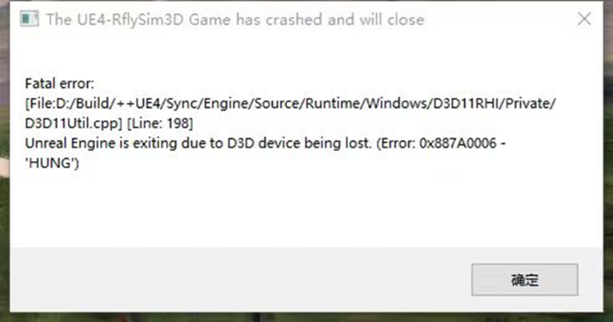
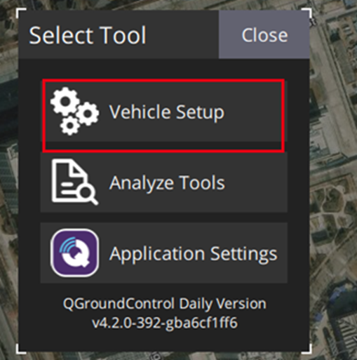
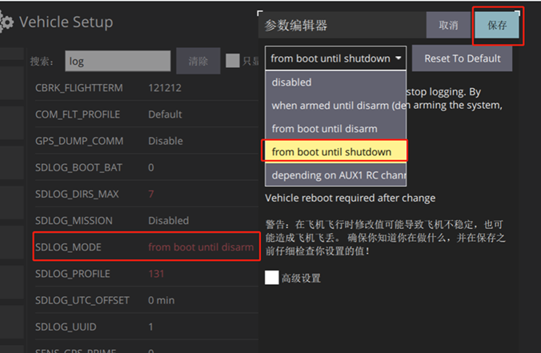

# 2.3、本章常见问题

## 2.3.1、SIL或HIL仿真时，RflySim3D出现：Fatal error:[File:D://Build/++UE4....]...报错

具体报错界面如下所示：

**问题解答：**

上述RflySim3D的报错问题，可能是由于电脑的显卡驱动所造成的兼容性问题，建议升级显卡驱动到最新版，看下能否解决；如果不能解决，请联系RflySim平台相关售后人员。

## 2.3.2、QGC的Analyze Tools-飞行日志，下载时刷新完之后，找不到我做硬件在环对应时间的日志

**问题解答：**

打开QGC，进入载具设置

到最下面的参数标签，搜索“log”，找到了SDLOG_MODE的参数，将其改成下图，从开机到关机，一直记录log，这样就能看到log日志了。

#### 更多问题请访问：https://github.com/RflySim/Docs/issues