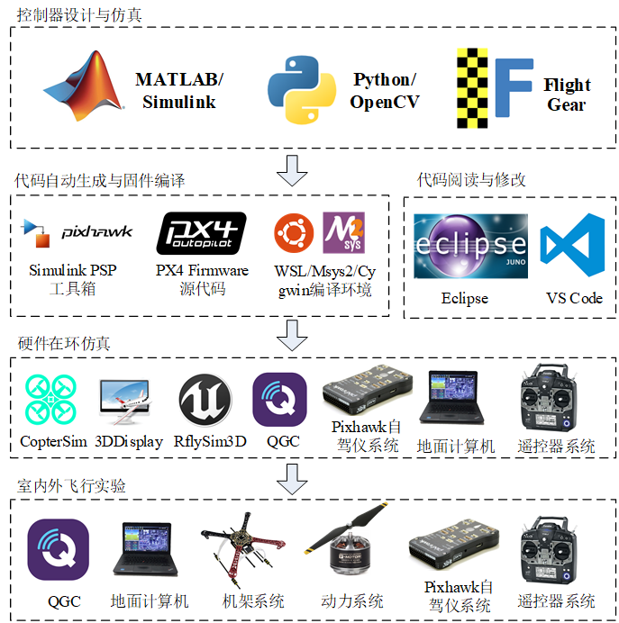

# 2.1、本章使用方法

RflySim平台包含了众多在进行无人系统建模、仿真、算法验证等开发过程中所涉及到的软件，其中，核心组件有CopterSim、QGroundControl、RflySim3D/RflySimUE5、Python38Env、Win10WSL子系统、SITL/HITLRun一键运行脚本、MATLAB自动代码生成工具箱、Simulink集群控制接口、PX4 Firmware源码、RflySim配套资料文件以及配套硬件系统。用户通过对这些核心组件的学习即可快速上手无人系统的开发和测试工作。

RflySim平台实验流程主要分为底层控制系统开发实验流程和顶层控制系统开发实验流程。其中，底层控制系统开发依据从易到难的依次顺序分为：算法开发与数字仿真验证阶段、简化模型联调阶段、软件在环仿真阶段、硬件在环仿真阶段、室内外飞行实验；顶层控制系统开发包括机载板卡硬件在环阶段、多机HIL仿真阶段、单机自主控制阶段、半实物集群控制阶段、真机集群控制阶段以及完全真实环境下的多机协同阶段。

## 本讲API文件
本讲开发相关API接口平台地址为：<a target="_blank" href="../RflySimAPIs/2.RflySimUsage/API.pdf">🔗API🔗</a>
## 本讲PPT文件 
本讲内容的PPT文档的平台地址为：<a target="_blank" href="../RflySimAPIs/2.RflySimUsage/PPT.pdf">🔗PPT🔗</a>
## 本讲所有例程文件
本讲所有例程请见Readme文档，该文件的平台地址为：<a target="_blank" href="../RflySimAPIs/2.RflySimUsage/Readme.pdf">🔗Readme🔗</a>

| 序号 | 实验名称 | Readme | 最低版本 |
| ---- | ---- | ---- | ---- |
| 1 | 飞控固件烧录 | <a target="_blank" href="../RflySimAPIs/2.RflySimUsage/1.BasicExps\e10_Firmware-Upload/Readme.pdf">Readme</a> | 免费版 |
| 2 | 飞控板载应用开发 | <a target="_blank" href="../RflySimAPIs/2.RflySimUsage/1.BasicExps\e12_PX4-App/Readme.pdf">Readme</a> | 免费版 |
| 3 | 四旋翼无人机配置 | <a target="_blank" href="../RflySimAPIs/2.RflySimUsage/1.BasicExps\e13_UAV-Config/Readme.pdf">Readme</a> | 免费版 |
| 4 | CopterSim获取Log数据 | <a target="_blank" href="../RflySimAPIs/2.RflySimUsage/1.BasicExps\e14_Log-Get/Readme.pdf">Readme</a> | 免费版 |
| 5 | RflySim3D三维场景加载 | <a target="_blank" href="../RflySimAPIs/2.RflySimUsage/1.BasicExps\e15_Scene-Load/Readme.pdf">Readme</a> | 免费版 |
| 6 | Pixhawk硬件编译命令识别 | <a target="_blank" href="../RflySimAPIs/2.RflySimUsage/1.BasicExps\e16_Identify-Hardware-Command/Readme.pdf">Readme</a> | 免费版 |
| 7 | HIL航线绘制 | <a target="_blank" href="../RflySimAPIs/2.RflySimUsage/1.BasicExps\e17_RoutePlanning/Readme.pdf">Readme</a> | 免费版 |
| 8 | CopterSim模型设计 | <a target="_blank" href="../RflySimAPIs/2.RflySimUsage/1.BasicExps\e1_CopterSim-Usage/Readme.pdf">Readme</a> | 免费版 |
| 9 | CopterSim导入DLL | <a target="_blank" href="../RflySimAPIs/2.RflySimUsage/1.BasicExps\e2_DLL-Load/Readme.pdf">Readme</a> | 免费版 |
| 10 | RflySim3D快捷键与指令 | <a target="_blank" href="../RflySimAPIs/2.RflySimUsage/1.BasicExps\e3_RflySim3D-Shortcut-Instruct/Readme.pdf">Readme</a> | 免费版 |
| 11 | Python38Env读取飞行日志 | <a target="_blank" href="../RflySimAPIs/2.RflySimUsage/1.BasicExps\e4_Log-Reads-Python38Env/Readme.pdf">Readme</a> | 免费版 |
| 12 | 手动软件在环仿真配置 | <a target="_blank" href="../RflySimAPIs/2.RflySimUsage/1.BasicExps\e5_Manual-SIL/Readme.pdf">Readme</a> | 免费版 |
| 13 | BAT脚本启动组件 | <a target="_blank" href="../RflySimAPIs/2.RflySimUsage/1.BasicExps\e6_BAT-Startup/Readme.pdf">Readme</a> | 免费版 |
| 14 | MATLAB代码自动生成飞控固件 | <a target="_blank" href="../RflySimAPIs/2.RflySimUsage/1.BasicExps\e7_Code-Generation/Readme.pdf">Readme</a> | 免费版 |
| 15 | Simulink集群控制接口 | <a target="_blank" href="../RflySimAPIs/2.RflySimUsage/1.BasicExps\e8_SwarmAPI/Readme.pdf">Readme</a> | 免费版 |
| 16 | 固件编译 | <a target="_blank" href="../RflySimAPIs/2.RflySimUsage/1.BasicExps\e9_Build-Firmware/Readme.pdf">Readme</a> | 免费版 |
| 17 | QGC显示共享内存图像 | <a target="_blank" href="../RflySimAPIs/2.RflySimUsage/2.AdvExps\e1_QGCLoadimage/Readme.pdf">Readme</a> | 集合版 |
