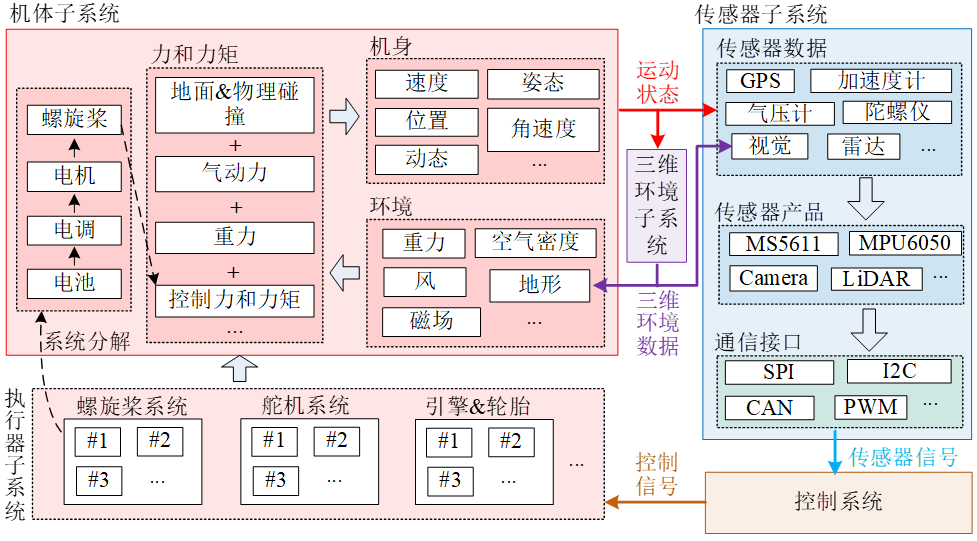

# 4.1、本章使用方法

无人载具系统统一建模框架将整个无人载具系统分解为两个部分：机身系统与控制系统。机身系统与控制系统之间进行着传感器数据与控制信号。而机身系统又可以细分为四个子系统：机体子系统、执行器子系统、三维环境子系统和传感器子系统。

• 机体子系统包含了机身、运行环境、力与力矩等内部子系统模块，是对机体在环境的运动、能耗和故障特性的整体描述；

• 执行器子系统包含了飞行器与外界环境的相互作用，它接收来之控制系统的控制信号，然后产生的力与力矩来驱动机身运动；

• 传感器子系统主要用于描述控制软件之外的所有电子硬件模型，主要包含传感器数据、通信协议、连接接口等特性；

• 三维环境子系统主要用于描述无人飞行的三维视景环境（包括树木、障碍物、公路等），用于为自主控制系统提供视觉数据的模拟。

在整个建模框架中，机身系统需要进行高精度建模，并且在实时仿真计算机中实现，最后连接控制系统软件或硬件，构成软件在环仿真或硬件在环仿真闭环。

上述建模框架可以在Simulink等可视化建模与仿真软件中快速实现，在整个仿真模型搭建完毕后，可以利用自动代码生成的方法生成不同实时仿真计算机环境下的仿真软件，并且通过替代其中特定的子系统模块可以快速扩展得到不同类型的载具模型。所示为Simulink中搭建大多旋翼仿真模型示例，它包含了基本的运动仿真功能以及故障注入功能，能够非常逼真地仿真各种多旋翼的运动动态。

同时，RflySim提供Simulink无人动力学建模模版，支持多种旋翼类型，便于模型开发与扩展；提供标准输入输出接口，可在Simulink中自行搭建任意构型无人模型；支持Simulink自动代码生成为DLL文件的形式导入到硬件在环仿真器中；动力系统组件数据库覆盖市面上2000款以上组件产品，支持从数据库中选择合适的电机、螺旋桨等组件组装不同构型多旋翼（三、四、六、八旋翼）并估算性能（悬停时间、最大拉力等）与模型参数（质量、转动惯量、螺旋桨拉力系数等），用于多旋翼动力学仿真。

## 本讲API文件
本讲开发相关API接口平台地址为：<a target="_blank" href="../RflySimAPIs/4.RflySimModel/API.pdf">🔗API🔗</a>
## 本讲PPT文件 
本讲内容的PPT文档的平台地址为：<a target="_blank" href="../RflySimAPIs/4.RflySimModel/PPT.pdf">🔗PPT🔗</a>
## 本讲所有例程文件
本讲所有例程请见Readme文档，该文件的平台地址为：<a target="_blank" href="../RflySimAPIs/4.RflySimModel/Readme.pdf">🔗Readme🔗</a>

| 序号 | 实验名称 | Readme | 最低版本 |
| ---- | ---- | ---- | ---- |
| 1 | 平台固件生成介绍 | <a target="_blank" href="../RflySimAPIs/4.RflySimModel/0.ApiExps\1.PX4FirmwareGen/Readme.pdf">Readme</a> | 免费版 |
| 2 | 自主生成C/C++代码实验 | <a target="_blank" href="../RflySimAPIs/4.RflySimModel/0.ApiExps\2.UserDefinedC++/Readme.pdf">Readme</a> | 免费版 |
| 3 | 平台建模模板之最小模板使用介绍 | <a target="_blank" href="../RflySimAPIs/4.RflySimModel/1.BasicExps\e1_MinModelTemp/Readme.pdf">Readme</a> | 免费版 |
| 4 | 平台固定翼无人机软硬件在环仿真实验 | <a target="_blank" href="../RflySimAPIs/4.RflySimModel/1.BasicExps\e2_FixWingModelCtrl/Readme.pdf">Readme</a> | 免费版 |
| 5 | 阿克曼底盘无人车模型代码生成及软硬件在环仿真 | <a target="_blank" href="../RflySimAPIs/4.RflySimModel/1.BasicExps\e3_CarAckermanModeCtrl/Readme.pdf">Readme</a> | 免费版 |
| 6 | 差动无人车模型代码生成及软硬件在环仿真 | <a target="_blank" href="../RflySimAPIs/4.RflySimModel/1.BasicExps\e4_CarR1DiffModelCtrl/Readme.pdf">Readme</a> | 免费版 |
| 7 | 外部通信实验之读取状态估计值 | <a target="_blank" href="../RflySimAPIs/4.RflySimModel/2.AdvExps\e0_AdvApiExps\1.ExtCtrlAPI-UDP20100/Readme.pdf">Readme</a> | 个人版 |
| 8 | inSILInts和inSILFloats接口实验 | <a target="_blank" href="../RflySimAPIs/4.RflySimModel/2.AdvExps\e0_AdvApiExps\10.InSILInts&Floats/Readme.pdf">Readme</a> | 个人版 |
| 9 | 外部通信实验之读取仿真真值数据 | <a target="_blank" href="../RflySimAPIs/4.RflySimModel/2.AdvExps\e0_AdvApiExps\2.ExtCtrlAPI-UDP30100/Readme.pdf">Readme</a> | 个人版 |
| 10 | 外部通信实验之获取平台rfly_px4 uORB消息 | <a target="_blank" href="../RflySimAPIs/4.RflySimModel/2.AdvExps\e0_AdvApiExps\3.ExtCtrlAPI-UDP40100/Readme.pdf">Readme</a> | 个人版 |
| 11 | ExtToUE4接口验证实验 | <a target="_blank" href="../RflySimAPIs/4.RflySimModel/2.AdvExps\e0_AdvApiExps\4.ExtToUE4/Readme.pdf">Readme</a> | 个人版 |
| 12 | ExtToPX4接口验证 | <a target="_blank" href="../RflySimAPIs/4.RflySimModel/2.AdvExps\e0_AdvApiExps\5.ExtToPX4/Readme.pdf">Readme</a> | 个人版 |
| 13 | 电机故障注入测试仿真 | <a target="_blank" href="../RflySimAPIs/4.RflySimModel/2.AdvExps\e0_AdvApiExps\6.InFaultAPITest/Readme.pdf">Readme</a> | 个人版 |
| 14 | 最大模型outCopterData接口验证 | <a target="_blank" href="../RflySimAPIs/4.RflySimModel/2.AdvExps\e0_AdvApiExps\7.OutCopterData/Readme.pdf">Readme</a> | 个人版 |
| 15 | FaultInParam动态修改参数验证 | <a target="_blank" href="../RflySimAPIs/4.RflySimModel/2.AdvExps\e0_AdvApiExps\8.FaultParamsDynMod/Readme.pdf">Readme</a> | 个人版 |
| 16 | InFloatsCollision的物理引擎验证 | <a target="_blank" href="../RflySimAPIs/4.RflySimModel/2.AdvExps\e0_AdvApiExps\9.InFloatsCollision/Readme.pdf">Readme</a> | 个人版 |
| 17 | 平台建模模板之最大模板使用介绍 | <a target="_blank" href="../RflySimAPIs/4.RflySimModel/2.AdvExps\e1_MaxModelTemp/Readme.pdf">Readme</a> | 集合版 |
| 18 | 四旋翼模型DLL生成及SIL/HIL实验 | <a target="_blank" href="../RflySimAPIs/4.RflySimModel/2.AdvExps\e2_MultiModelCtrl\1.MultiModelCtrl/Readme.pdf">Readme</a> | 集合版 |
| 19 | 四旋翼模型DLL生成及SIL/HIL实验(含碰撞检测) | <a target="_blank" href="../RflySimAPIs/4.RflySimModel/2.AdvExps\e2_MultiModelCtrl\2.MultiModelCtrlColl/Readme.pdf">Readme</a> | 集合版 |
| 20 | 四旋翼综合模型仿真验证实验 | <a target="_blank" href="../RflySimAPIs/4.RflySimModel/2.AdvExps\e2_MultiModelCtrl\3.CopterSimSILNoPX4/Readme.pdf">Readme</a> | 集合版 |
| 21 | 六旋翼模型DLL生成及SIL/HIL实验 | <a target="_blank" href="../RflySimAPIs/4.RflySimModel/2.AdvExps\e2_MultiModelCtrl\4.HexModelCtrl/Readme.pdf">Readme</a> | 集合版 |
| 22 | 四轴八旋翼模型DLL生成及SIL/HIL实验 | <a target="_blank" href="../RflySimAPIs/4.RflySimModel/2.AdvExps\e2_MultiModelCtrl\5.OctoCoxRotor/Readme.pdf">Readme</a> | 集合版 |
| 23 | 八旋翼模型DLL生成及SIL/HIL实验 | <a target="_blank" href="../RflySimAPIs/4.RflySimModel/2.AdvExps\e2_MultiModelCtrl\6.OctoX/Readme.pdf">Readme</a> | 集合版 |
| 24 | 多旋翼控制实验 | <a target="_blank" href="../RflySimAPIs/4.RflySimModel/2.AdvExps\e2_MultiModelCtrl/Readme.pdf">Readme</a> | 集合版 |
| 25 | 固定翼飞机模型DLL生成及SIL/HIL实验(含碰撞检测) | <a target="_blank" href="../RflySimAPIs/4.RflySimModel/2.AdvExps\e3_FWingModelCtrl\1.FixWingModelCtrlColl/Readme.pdf">Readme</a> | 集合版 |
| 26 | 固定翼航点控制 | <a target="_blank" href="../RflySimAPIs/4.RflySimModel/2.AdvExps\e3_FWingModelCtrl\2.FWPosCtrlAPI/Readme.pdf">Readme</a> | 集合版 |
| 27 | 固定翼以固定俯仰角飞行实验 | <a target="_blank" href="../RflySimAPIs/4.RflySimModel/2.AdvExps\e3_FWingModelCtrl\3.FWAttCtrlAPI/Readme.pdf">Readme</a> | 集合版 |
| 28 | 固定翼速度/高度/偏航接口验证实验(Python) | <a target="_blank" href="../RflySimAPIs/4.RflySimModel/2.AdvExps\e3_FWingModelCtrl\4.VelAltYawCtrlAPI_Py/Readme.pdf">Readme</a> | 集合版 |
| 29 | 固定翼速度/高度/偏航接口验证实验(Simulink) | <a target="_blank" href="../RflySimAPIs/4.RflySimModel/2.AdvExps\e3_FWingModelCtrl\5.VelAltYawCtrlAPI_Mat/Readme.pdf">Readme</a> | 集合版 |
| 30 | 固定翼控制实验 | <a target="_blank" href="../RflySimAPIs/4.RflySimModel/2.AdvExps\e3_FWingModelCtrl/Readme.pdf">Readme</a> | 集合版 |
| 31 | 高精度垂直起降飞机DLL生成及SIL/HIL实验 | <a target="_blank" href="../RflySimAPIs/4.RflySimModel/2.AdvExps\e4_VTOLModelCtrl\1.VTOLModelCtrl/Readme.pdf">Readme</a> | 集合版 |
| 32 | 四旋翼尾座式垂起无人机软硬件在环仿真 | <a target="_blank" href="../RflySimAPIs/4.RflySimModel/2.AdvExps\e4_VTOLModelCtrl\2.TailsitterModelCtrl/Readme.pdf">Readme</a> | 集合版 |
| 33 | 垂直起降飞机控制实验 | <a target="_blank" href="../RflySimAPIs/4.RflySimModel/2.AdvExps\e4_VTOLModelCtrl/Readme.pdf">Readme</a> | 集合版 |
| 34 | Python控制阿克曼底盘无人车位置软/硬件在环仿真 | <a target="_blank" href="../RflySimAPIs/4.RflySimModel/2.AdvExps\e5_CarAckermanCtrl\1.CarAckermanPosCtrl_Py/Readme.pdf">Readme</a> | 集合版 |
| 35 | Matlab控制阿克曼底盘无人车位置软/硬件在环仿真 | <a target="_blank" href="../RflySimAPIs/4.RflySimModel/2.AdvExps\e5_CarAckermanCtrl\2.CarAckermanPosCtrl_Mat/Readme.pdf">Readme</a> | 集合版 |
| 36 | Python控制阿克曼底盘无人车速度软硬件在环仿真 | <a target="_blank" href="../RflySimAPIs/4.RflySimModel/2.AdvExps\e5_CarAckermanCtrl\3.CarAckermanVelCtrl_Py/Readme.pdf">Readme</a> | 集合版 |
| 37 | Matlab控制阿克曼底盘无人车速度软硬件在环仿真 | <a target="_blank" href="../RflySimAPIs/4.RflySimModel/2.AdvExps\e5_CarAckermanCtrl\4.CarAckermanVelCtrl_Mat/Readme.pdf">Readme</a> | 集合版 |
| 38 | 阿克曼底盘无人车控制实验 | <a target="_blank" href="../RflySimAPIs/4.RflySimModel/2.AdvExps\e5_CarAckermanCtrl/Readme.pdf">Readme</a> | 集合版 |
| 39 | Python控制差动无人车位置软硬件在环仿真 | <a target="_blank" href="../RflySimAPIs/4.RflySimModel/2.AdvExps\e6_CarR1DiffCtrl\1.CarR1DiffPosCtrl_Py/Readme.pdf">Readme</a> | 集合版 |
| 40 | Matlab控制差动无人车位置软硬件在环仿真 | <a target="_blank" href="../RflySimAPIs/4.RflySimModel/2.AdvExps\e6_CarR1DiffCtrl\2.CarR1DiffPosCtrl_Mat/Readme.pdf">Readme</a> | 集合版 |
| 41 | Python控制差动无人车速度软硬件在环仿真 | <a target="_blank" href="../RflySimAPIs/4.RflySimModel/2.AdvExps\e6_CarR1DiffCtrl\3.CarR1DiffVelCtrl_Py/Readme.pdf">Readme</a> | 集合版 |
| 42 | Matlab控制差动无人车速度软/硬件在环仿真 | <a target="_blank" href="../RflySimAPIs/4.RflySimModel/2.AdvExps\e6_CarR1DiffCtrl\4.CarR1DiffVelCtrl_Mat/Readme.pdf">Readme</a> | 集合版 |
| 43 | 差动无人车控制实验 | <a target="_blank" href="../RflySimAPIs/4.RflySimModel/2.AdvExps\e6_CarR1DiffCtrl/Readme.pdf">Readme</a> | 集合版 |
| 44 | 精细化无人车模型代码生成及软硬件在环仿真 | <a target="_blank" href="../RflySimAPIs/4.RflySimModel/2.AdvExps\e7_TrailerModelCtrl\1.TrailerModelCtrl/Readme.pdf">Readme</a> | 集合版 |
| 45 | 无人车综合模型仿真验证 | <a target="_blank" href="../RflySimAPIs/4.RflySimModel/2.AdvExps\e7_TrailerModelCtrl\2.TrailerNoPX4/Readme.pdf">Readme</a> | 集合版 |
| 46 | 精细化无人车控制实验 | <a target="_blank" href="../RflySimAPIs/4.RflySimModel/2.AdvExps\e7_TrailerModelCtrl/Readme.pdf">Readme</a> | 集合版 |
| 47 | 直升机模型软硬件在环仿真实验 | <a target="_blank" href="../RflySimAPIs/4.RflySimModel/3.CustExps\e1_Helicopter/Readme.pdf">Readme</a> | 完整版 |
| 48 | UUV模型硬件在环仿真实验 | <a target="_blank" href="../RflySimAPIs/4.RflySimModel/3.CustExps\e2_UUV/Readme.pdf">Readme</a> | 完整版 |
| 49 | 双旋翼垂尾模型代码生成及软硬件在环仿真 | <a target="_blank" href="../RflySimAPIs/4.RflySimModel/3.CustExps\e3_Tailsitter_Duo/Readme.pdf">Readme</a> | 完整版 |
