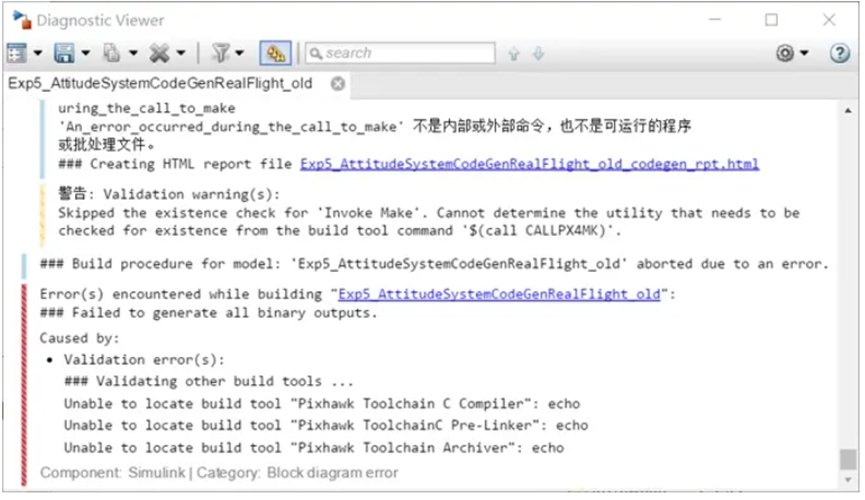
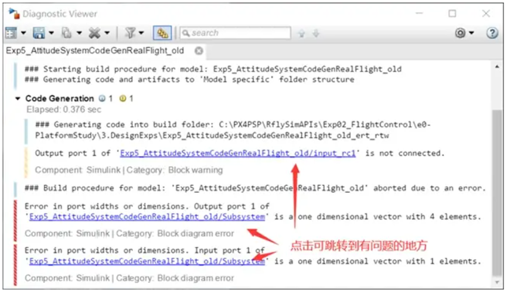
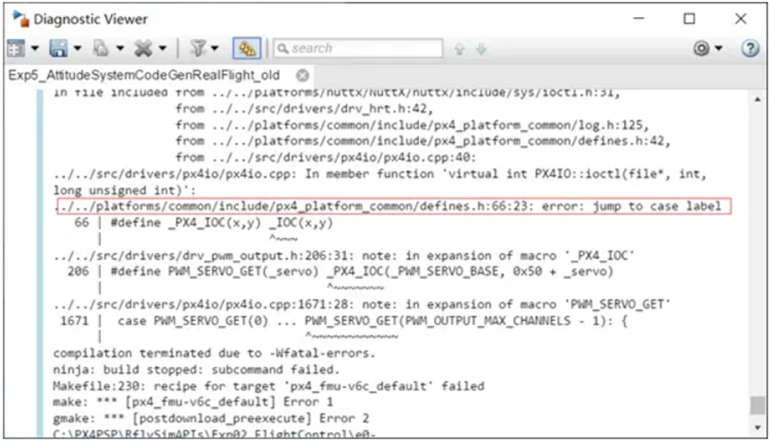
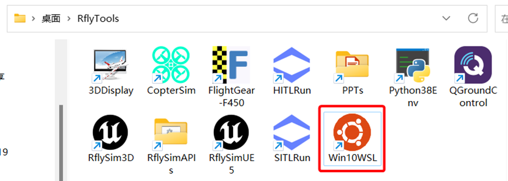
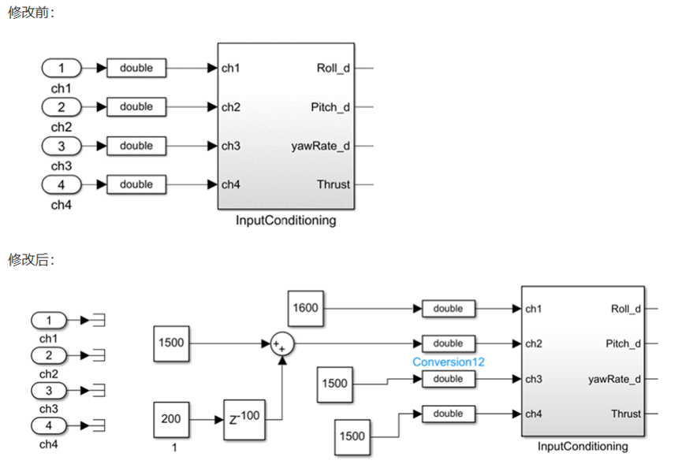
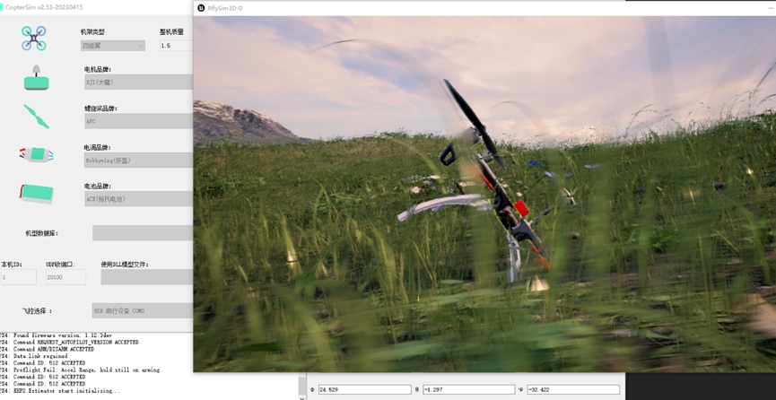
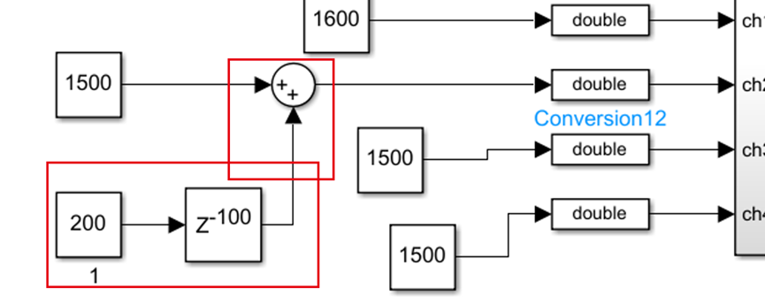
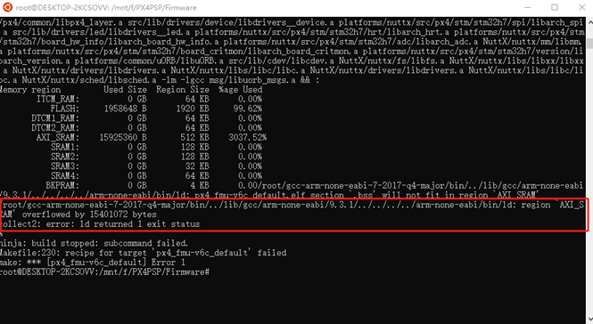
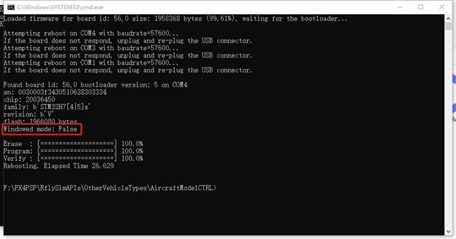

# 5.3、本章常见问题

## 5.3.1、MATLAB/Simulink在进行代码自动生成时，有时会出现如下报错。



```
Caused by:
Validation error(s):
\### Validating other build tools ...
Unable to locate build tool "Pixhawk Toolchain C Compiler": echo
Unable to locate build tool "Pixhawk ToolchainC Pre-Linker": echo
Unable to locate build tool "Pixhawk Toolchain Archiver": echo

```


若出现编译错误，可能的编译问题可以分为：MATLAB模型问题、PX4固件问题、MATLAB模型与PX4固件链接问题。

**问题解答：**

处理MATLAB模型问题。MATLAB自动代码生成会在编译的初始阶段检查模型，所以这类问题往往在点击编译按钮几秒钟就会显示出来。最为常见的MATLAB问题是各个接口的数据不匹配，点击提示错误的模块可跳转到有问题的地方。



处理PX4固件问题。若PX4源码有编译问题，那么一般会在MATLAB的编译日志提示中显示出来，下图显示了问题代码出现的位置，根据提示去修改。平台中PX4的固件位于PX4PSP\Firmware。



处理MATLAB模型与PX4固件链接问题。这类问题往往是PX4固件由于版本的升级而导致一些接口发生变化，而MATLAB自动代码生成的接口可能不匹配，所以在最终的链接阶段会发生错误。这类问题在MATLAB中看不到具体的错误，需要打开Win10WSL(选用其它编译工具的参考其它工具)，重新执行下编译命令如：`make px4_fmu-v6c_default`(其它版本换成其对应的命令)方可看到具体的问题。



## 5.3.2、在自动代码生成控制器中，用延迟模块直接生成控制指令，导致飞机乱飞。

**问题描述：**

在对例程：PX4PSP\RflySimAPIs\Exp02_FlightControl\e5-AttitudeCtrl\e5.1\HIL将遥控器输入CH1-CH4与inputConditioning模块断开，更改滚转（CH1）、俯仰（CH2）、油门（CH3）、偏航（CH4）的输入信号为我们自己想要的定值输入，只对AttitudeControl_HIL.slx做了这一个地方的修改，然后跟原AttitudeControl_HIL.slx例程一样的操作步骤对其进行硬件在环仿真，启动硬件在环后，飞机自己在地上乱飞，过一会后会出现报错，这是什么原因？该怎么解决？



仿真现象：更改后，进行硬件在环仿真时，无人机在地上乱飞。



这种修改方式不可行，因为这个200个step的延迟，总共才200*0.001=0.2秒。因为px4_simulink_app程序是上电就开始运行的，因此相当于上电之后，过一下就输入了控制指令，变成满油门状态了。这种情况下，飞控还没初始化完毕，滤波器触发发散状态，没有得到准确的位姿信息。



完美方案：直接读取EKF状态的uORB消息，判断滤波器初始化完毕后，再延迟一段时间给控制指令。简单方案：把延迟时间再拉大一点，或者直接用MATLAB函数写一个触发机制，等仿真时间达到60s以后，再给控制指令。

## 5.3.3、如何做无人机姿态自主控制？

**问题描述：**

详细描述为：我们需要让无人机飞到一定高度定住，然后跟据我们自己给定的姿态角期望值输入，让无人机自主去动作，使三个姿态角动作到给定的期望值。

**问题解答：**

遥控器的通道可以用于传递触发信息，例如，CH5拨到满位置，程序就开始自动执行，在Simulink里面写个状态机，让飞机先起飞，等达到高度后，再且姿态控制。具体的控制器设计方法，属于Simulink编程范畴，可查阅相关文献资料进行了解。如果切换定高后，想从外部输入期望姿态角之类信息，请使用[0.ApiExps\9.PX4CtrlExternalTune\Readme.pdf](0.ApiExps/9.PX4CtrlExternalTune/Readme.pdf)这个目录里面的外部控制接口，在飞控内部订阅rfly_ctrls的消息（外部程序传入的），作为期望姿态角即可。

## 5.3.4、姿态控制硬件在环的结果数据怎么得到？目前我了解的下载飞行日志的方式可以得到我想要的吗？

**问题解答：**

请使用[0.ApiExps\9.PX4CtrlExternalTune\Readme.pdf](0.ApiExps/9.PX4CtrlExternalTune/Readme.pdf)例程的接口，可以在Simulink里面实时获取模型的真实姿态（仿真值），和飞控内部传出的数据（填入飞控姿态），飞行日志也可以得到类似数据。

## 5.3.5、Win10WSL编译固件时，显示：region `AXI_SRAM' overflowed by 15401072 bytes

**问题描述：**





**问题解答：**

该问题为所编译的固件较大，超出了飞控的内容，造成固件溢出报错。可进入PX4的Cmake文件中注释掉部分未在使用的模块，Pixhawk系列飞控具体地址为：*PX4PSP\Firmware\boards\px4。如：所进行的实验为四旋翼相关底层控制算法开发实验，所使用的飞控为Pixhawk 6C，可对C:\PX4PSP\Firmware\boards\px4\fmu-v6c\default.cmake，该文件中的未使用的模块进行注释(如下)，然后再编译。

```
……
	MODULES
		airspeed_selector
		px4_simulink_app
		attitude_estimator_q
		camera_feedback
		commander
		dataman
		ekf2
		esc_battery
		events
		flight_mode_manager
		# fw_att_control      注释掉固定翼姿态控制模块
		fw_pos_control_l1
		gyro_calibration
		gyro_fft
		land_detector
		landing_target_estimator
		load_mon
		local_position_estimator
		logger
		mavlink
		mc_att_control
		mc_hover_thrust_estimator
		mc_pos_control
		mc_rate_control
		#micrortps_bridge
		navigator
		rc_update
		rover_pos_control
		sensors
		sih
		temperature_compensation
		# uuv_att_control     注释掉UUV姿态控制模块
		# uuv_pos_control     注释掉UUV位置控制模块
		vmount 
		# vtol_att_control     注释掉VTOL姿态控制模块
……
```

#### 更多问题请访问：https://github.com/RflySim/Docs/issues