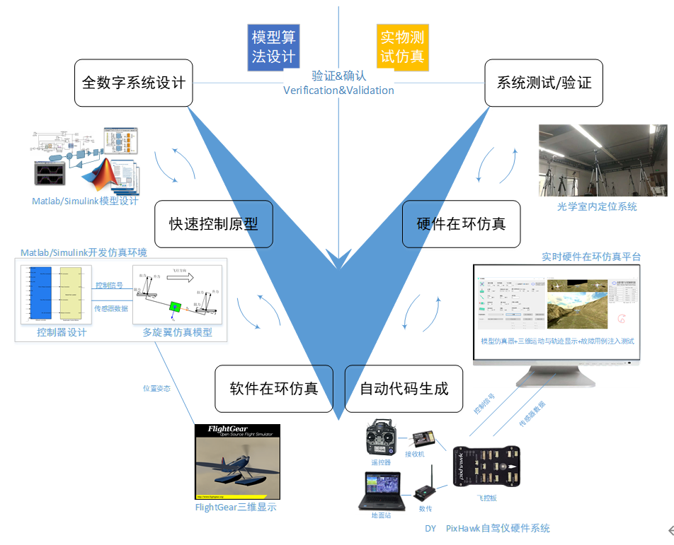

# 5.1、本章使用方法

RflySim采用基于模型设计（Model-Based Design，MBD）的思想，可用于无人系统的控制和安全测试。通过以下五个阶段：建模阶段、控制器设计阶段、软件在环仿真阶段（Software-In-the-Loop，SIL）、硬件在环仿真阶段（Hardware-In-the-Loop，HIL）和实飞测试阶段。通过MATLAB/Simulink的自动代码生成技术，控制器能够被方便地自动下载到硬件中，用于HIL仿真和实际飞行测试。

在MATLAB/Simulink 中提供了多旋翼控制器设计的相关接口，用户(初学者、学生或者工程师)可以利用自己所学知识快速进行控制器的设计与验证。在控制器设计完成后，本平台提供代码生成与下载功能，可以将设计的 Simulink 控制算法生成 C/C++ 代码，然后将其编译进入PX4自驾仪固件中，并自动下载到自驾仪中。本平台还提供硬件在环仿真测试功能，用户可以在真实 Pixhawk 自驾仪系统上对飞行效果进行初步模拟测试，排除实飞实验可能存在的各种问题。测试通过之后，将 Pixhawk 自驾仪装在一个多旋翼硬件系统上，就可以进行室内和室外的飞行实验，通过实验验证来评估设计控制算法的性能。RflySim平台安装完成后，

## 本讲API文件
本讲开发相关API接口平台地址为：<a target="_blank" href="../RflySimAPIs/5.RflySimFlyCtrl/API.pdf">🔗API🔗</a>
## 本讲PPT文件 
本讲内容的PPT文档的平台地址为：<a target="_blank" href="../RflySimAPIs/5.RflySimFlyCtrl/PPT.pdf">🔗PPT🔗</a>
## 本讲所有例程文件
本讲所有例程请见Readme文档，该文件的平台地址为：<a target="_blank" href="../RflySimAPIs/5.RflySimFlyCtrl/Readme.pdf">🔗Readme🔗</a>

| 序号 | 实验名称 | Readme | 最低版本 |
| ---- | ---- | ---- | ---- |
| 1 | 资源文件安装 | <a target="_blank" href="../RflySimAPIs/5.RflySimFlyCtrl/0.ApiExps\0.ResourcesFile/Readme.pdf">Readme</a> | 免费版 |
| 2 | 软件在环仿真 | <a target="_blank" href="../RflySimAPIs/5.RflySimFlyCtrl/0.ApiExps\1.SoftwareSimExps/Readme.pdf">Readme</a> | 免费版 |
| 3 | QGC实时调整控制器参数 | <a target="_blank" href="../RflySimAPIs/5.RflySimFlyCtrl/0.ApiExps\10.QGC-Param-Tune/Readme.pdf">Readme</a> | 免费版 |
| 4 | 传感器数据读取 | <a target="_blank" href="../RflySimAPIs/5.RflySimFlyCtrl/0.ApiExps\11.SenorDataGet/Readme.pdf">Readme</a> | 免费版 |
| 5 | 自驾仪CPU使用率查看 | <a target="_blank" href="../RflySimAPIs/5.RflySimFlyCtrl/0.ApiExps\12.AutopilotCPUUsageGet/Readme.pdf">Readme</a> | 免费版 |
| 6 | Simulink中M-Fucnction和S-Function对自驾仪系统资源占用对比 | <a target="_blank" href="../RflySimAPIs/5.RflySimFlyCtrl/0.ApiExps\13.Simulink_MS_FuncVS/Readme.pdf">Readme</a> | 免费版 |
| 7 | SITL验证自动代码生成代码 | <a target="_blank" href="../RflySimAPIs/5.RflySimFlyCtrl/0.ApiExps\14.SITLVeriGenCodeFirm/Readme.pdf">Readme</a> | 免费版 |
| 8 | PSP官方提供 | <a target="_blank" href="../RflySimAPIs/5.RflySimFlyCtrl/0.ApiExps\2.PSPOfficialExps/Readme.pdf">Readme</a> | 免费版 |
| 9 | 姿态控制器设计 | <a target="_blank" href="../RflySimAPIs/5.RflySimFlyCtrl/0.ApiExps\3.DesignExps/Readme.pdf">Readme</a> | 免费版 |
| 10 | 飞控固件上传 | <a target="_blank" href="../RflySimAPIs/5.RflySimFlyCtrl/0.ApiExps\4.PX4Firmwares/Readme.pdf">Readme</a> | 免费版 |
| 11 | log数据记录与读取 | <a target="_blank" href="../RflySimAPIs/5.RflySimFlyCtrl/0.ApiExps\5.Log-Write-Read/Readme.pdf">Readme</a> | 免费版 |
| 12 | uORB 消息读取与写入 | <a target="_blank" href="../RflySimAPIs/5.RflySimFlyCtrl/0.ApiExps\6.uORB-Read-Write/Readme.pdf">Readme</a> | 免费版 |
| 13 | 自定义uORB消息 | <a target="_blank" href="../RflySimAPIs/5.RflySimFlyCtrl/0.ApiExps\7.uORB-Create/Readme.pdf">Readme</a> | 免费版 |
| 14 | 回传提示消息 | <a target="_blank" href="../RflySimAPIs/5.RflySimFlyCtrl/0.ApiExps\8.Mavlink-Msg-Echo/Readme.pdf">Readme</a> | 免费版 |
| 15 | PX4控制器的外部通信 | <a target="_blank" href="../RflySimAPIs/5.RflySimFlyCtrl/0.ApiExps\9.PX4CtrlExternalTune/Readme.pdf">Readme</a> | 免费版 |
| 16 | 动力系统设计 | <a target="_blank" href="../RflySimAPIs/5.RflySimFlyCtrl/1.BasicExps\e1-FlightEval/Readme.pdf">Readme</a> | 免费版 |
| 17 | 动态建模 | <a target="_blank" href="../RflySimAPIs/5.RflySimFlyCtrl/1.BasicExps\e2-UavModeling/Readme.pdf">Readme</a> | 免费版 |
| 18 | 传感器标定 | <a target="_blank" href="../RflySimAPIs/5.RflySimFlyCtrl/1.BasicExps\e3-SensorCalib/Readme.pdf">Readme</a> | 免费版 |
| 19 | 滤波器设计 | <a target="_blank" href="../RflySimAPIs/5.RflySimFlyCtrl/1.BasicExps\e4-FilterDesign/Readme.pdf">Readme</a> | 免费版 |
| 20 | 姿态控制器设计 | <a target="_blank" href="../RflySimAPIs/5.RflySimFlyCtrl/1.BasicExps\e5-AttitudeCtrl/Readme.pdf">Readme</a> | 免费版 |
| 21 | 定点位置控制器设计实验 | <a target="_blank" href="../RflySimAPIs/5.RflySimFlyCtrl/1.BasicExps\e6-PositionCtrl/Readme.pdf">Readme</a> | 免费版 |
| 22 | 半自主控制模式设计实验 | <a target="_blank" href="../RflySimAPIs/5.RflySimFlyCtrl/1.BasicExps\e7-SemiAutoCtrl/Readme.pdf">Readme</a> | 免费版 |
| 23 | 失效保护逻辑设计实验 | <a target="_blank" href="../RflySimAPIs/5.RflySimFlyCtrl/1.BasicExps\e8-FailsafeLogic/Readme.pdf">Readme</a> | 免费版 |
| 24 | PX4模块替换 | <a target="_blank" href="../RflySimAPIs/5.RflySimFlyCtrl/1.BasicExps\e9-ReplacePX4Module/Readme.pdf">Readme</a> | 免费版 |
| 25 | 自定义屏蔽PX4中任意模块输出 | <a target="_blank" href="../RflySimAPIs/5.RflySimFlyCtrl/2.AdvExps\e0_AdvApiExps\1.CusMaskPX4Code/Readme.pdf">Readme</a> | 个人版 |
| 26 | 重命名PX4应用名称 | <a target="_blank" href="../RflySimAPIs/5.RflySimFlyCtrl/2.AdvExps\e0_AdvApiExps\2.RenamePX4App/Readme.pdf">Readme</a> | 个人版 |
| 27 | 加载PX4应用 | <a target="_blank" href="../RflySimAPIs/5.RflySimFlyCtrl/2.AdvExps\e0_AdvApiExps\3.LoadPX4App/Readme.pdf">Readme</a> | 个人版 |
| 28 | 创建多个PX4应用 | <a target="_blank" href="../RflySimAPIs/5.RflySimFlyCtrl/2.AdvExps\e0_AdvApiExps\4.MultPX4App/Readme.pdf">Readme</a> | 个人版 |
| 29 | ADRC姿态控制器设计 | <a target="_blank" href="../RflySimAPIs/5.RflySimFlyCtrl/2.AdvExps\e1_ADRC-CtrlExp\1.AttitudeCtrl-ADRC/Readme.pdf">Readme</a> | 集合版 |
| 30 | ADRC相关控制设计实验 | <a target="_blank" href="../RflySimAPIs/5.RflySimFlyCtrl/2.AdvExps\e1_ADRC-CtrlExp/Readme.pdf">Readme</a> | 集合版 |
| 31 | MCC姿态控制器设计 | <a target="_blank" href="../RflySimAPIs/5.RflySimFlyCtrl/2.AdvExps\e2_MCC-CtrlExp\1.AttitudeCtrl-MCC/Readme.pdf">Readme</a> | 集合版 |
| 32 | MCC定高控制器设计 | <a target="_blank" href="../RflySimAPIs/5.RflySimFlyCtrl/2.AdvExps\e2_MCC-CtrlExp\2.AltitudeCtrl-MCC/Readme.pdf">Readme</a> | 集合版 |
| 33 | MCC定点控制器设计 | <a target="_blank" href="../RflySimAPIs/5.RflySimFlyCtrl/2.AdvExps\e2_MCC-CtrlExp\3.PositionCtrl-MCC/Readme.pdf">Readme</a> | 集合版 |
| 34 | MCC半自主控制器设计 | <a target="_blank" href="../RflySimAPIs/5.RflySimFlyCtrl/2.AdvExps\e2_MCC-CtrlExp\4.SemiAutoCtrl-MCC/Readme.pdf">Readme</a> | 集合版 |
| 35 | 进阶接口类实验 | <a target="_blank" href="../RflySimAPIs/5.RflySimFlyCtrl/2.AdvExps\e2_MCC-CtrlExp/Readme.pdf">Readme</a> | 集合版 |
