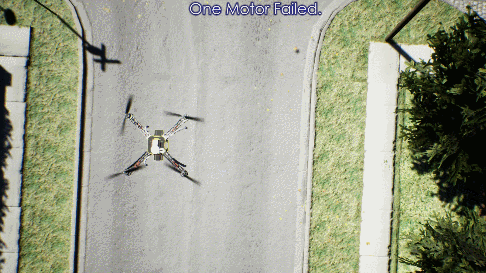

# 7.2、本章精彩案例

### 
 电机失效故障硬件在环仿真 

### 
 吊舱故障仿真 

<iframe src="//player.bilibili.com/player.html?aid=923265796&bvid=BV1DT4y1W7XN&cid=1395041116&p=1" allowfullscreen="allowfullscreen" width="100%" height=405 scrolling="no" frameborder="0" sandbox="allow-top-navigation allow-same-origin allow-forms allow-scripts"> </iframe>

### 
 网络故障仿真 

<iframe src="//player.bilibili.com/player.html?aid=240856481&bvid=BV1ve411i7aq&cid=1395001046&p=1" allowfullscreen="allowfullscreen" width="100%" height=405 scrolling="no" frameborder="0" sandbox="allow-top-navigation allow-same-origin allow-forms allow-scripts"> </iframe>

### 
 激光雷达故障仿真 

<iframe src="//player.bilibili.com/player.html?aid=495817112&bvid=BV1NK411x7tk&cid=1395001252&p=1" allowfullscreen="allowfullscreen" width="100%" height=405 scrolling="no" frameborder="0" sandbox="allow-top-navigation allow-same-origin allow-forms allow-scripts"> </iframe>

### 
 电机故障仿真 

<iframe src="//player.bilibili.com/player.html?aid=495788936&bvid=BV1oK411s7Kt&cid=1395001257&p=1" allowfullscreen="allowfullscreen" width="100%" height=405 scrolling="no" frameborder="0" sandbox="allow-top-navigation allow-same-origin allow-forms allow-scripts"> </iframe>