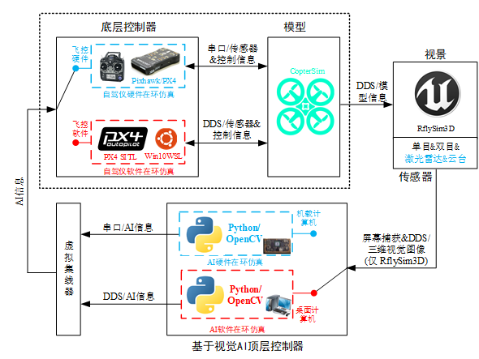

# 8.1、本章使用方法
​     RflySim平台支持外部传感器接入，我们将这些传感器数据分为两类：一类直连飞控的外部传感器（磁罗盘、差分GPS、光流测速等），另一类是直连机载计算机的视觉传感器（双目、Lidar、深度相机等）飞控传感器通过Simulink等程序直接生成传入Pixhawk飞控，视觉传感器通过三维环境引擎生成，随图像传入机载计算机。RflySim提供传感器基本参数与安装位置的深度相机传感器模块SDK，用户可以通过设置相关参数对无人机载视觉传感器进行设计朝向、焦距、视场角等，自定义机载视觉模块；根据用决策的输入输出接口协议，提供决策系统输入/输出接口。

## 本讲API文件
本讲开发相关API接口平台地址为：<a target="_blank" href="../RflySimAPIs/8.RflySimVision/API.pdf">🔗API🔗</a>
## 本讲PPT文件 
本讲内容的PPT文档的平台地址为：<a target="_blank" href="../RflySimAPIs/8.RflySimVision/PPT.pdf">🔗PPT🔗</a>
## 本讲所有例程文件
本讲所有例程请见Readme文档，该文件的平台地址为：<a target="_blank" href="../RflySimAPIs/8.RflySimVision/Readme.pdf">🔗Readme🔗</a>

| 序号 | 实验名称 | Readme | 最低版本 |
| ---- | ---- | ---- | ---- |
| 1 | 取图接口实验 | <a target="_blank" href="../RflySimAPIs/8.RflySimVision/0.ApiExps\1-UsageAPI\0.VisionSenorAPI\1.CameraImageGet/Readme.pdf">Readme</a> | 免费版 |
| 2 | 多目相机实验取图实验 | <a target="_blank" href="../RflySimAPIs/8.RflySimVision/0.ApiExps\1-UsageAPI\0.VisionSenorAPI\2.MutCameraImageGet/Readme.pdf">Readme</a> | 免费版 |
| 3 | 无CopterSim取图实验 | <a target="_blank" href="../RflySimAPIs/8.RflySimVision/0.ApiExps\1-UsageAPI\0.VisionSenorAPI\3.NoCopterSimImageGet/Readme.pdf">Readme</a> | 免费版 |
| 4 | 深度图获取实验 | <a target="_blank" href="../RflySimAPIs/8.RflySimVision/0.ApiExps\1-UsageAPI\0.VisionSenorAPI\4.IMUCarmDataGet/Readme.pdf">Readme</a> | 免费版 |
| 5 | 深度图获取实验 | <a target="_blank" href="../RflySimAPIs/8.RflySimVision/0.ApiExps\1-UsageAPI\0.VisionSenorAPI\5.DepthCameraDemo/Readme.pdf">Readme</a> | 免费版 |
| 6 | 飞机、物体、相机信息获取实验 | <a target="_blank" href="../RflySimAPIs/8.RflySimVision/0.ApiExps\1-UsageAPI\0.VisionSenorAPI\6.GetCamObjDemo/Readme.pdf">Readme</a> | 免费版 |
| 7 | 轻量级无人机模型控制实验 | <a target="_blank" href="../RflySimAPIs/8.RflySimVision/0.ApiExps\1-UsageAPI\1.UAVCtrlNoPX4Demo\1.UAVCtrlNoPX4Demo/Readme.pdf">Readme</a> | 免费版 |
| 8 | 获取RflySim3D内所有动态创建物体位置、碰撞数据实验 | <a target="_blank" href="../RflySimAPIs/8.RflySimVision/0.ApiExps\1-UsageAPI\4.RflySim3DAPI\1.RflySim3DPosGet/Readme.pdf">Readme</a> | 免费版 |
| 9 | 基础接口类实验 | <a target="_blank" href="../RflySimAPIs/8.RflySimVision/0.ApiExps\1-UsageAPI/Readme.pdf">Readme</a> | 免费版 |
| 10 | 共享内存实验 | <a target="_blank" href="../RflySimAPIs/8.RflySimVision/0.ApiExps\2-DistributedSimAPI\1.VisionAPIsTest\0-VisionCapAPI-SharedMemory/Readme.pdf">Readme</a> | 免费版 |
| 11 | 基础接口类实验 | <a target="_blank" href="../RflySimAPIs/8.RflySimVision/0.ApiExps\2-DistributedSimAPI/Readme.pdf">Readme</a> | 免费版 |
| 12 | 基础接口类实验 | <a target="_blank" href="../RflySimAPIs/8.RflySimVision/0.ApiExps\3-VisionAIAPI/Readme.pdf">Readme</a> | 免费版 |
| 13 | 基础功能性实验 | <a target="_blank" href="../RflySimAPIs/8.RflySimVision/1.BasicExps\1-VisionCtrlDemos/Readme.pdf">Readme</a> | 免费版 |
| 14 | 共享内存方式吊舱视觉控制键盘仿真实验 | <a target="_blank" href="../RflySimAPIs/8.RflySimVision/1.BasicExps\1-VisionCtrlDemos\e2_CameraKeyDemoOnWindows\BaseVersion/Readme.pdf">Readme</a> | 免费版 |
| 15 | 三无人机分布式控制实验 | <a target="_blank" href="../RflySimAPIs/8.RflySimVision/1.BasicExps\1-VisionCtrlDemos\e4_CrossRing\ThreeUAVDemo/Readme.pdf">Readme</a> | 免费版 |
| 16 | 双无人机分布式控制实验 | <a target="_blank" href="../RflySimAPIs/8.RflySimVision/1.BasicExps\1-VisionCtrlDemos\e4_CrossRing\TwoUAVDemo/Readme.pdf">Readme</a> | 免费版 |
| 17 | 屏幕截图接口、撞击小球实验 | <a target="_blank" href="../RflySimAPIs/8.RflySimVision/1.BasicExps\1-VisionCtrlDemos\e5_ScreenCapAPI\1-ShootBall/Readme.pdf">Readme</a> | 免费版 |
| 18 | 无人机穿环实验 | <a target="_blank" href="../RflySimAPIs/8.RflySimVision/1.BasicExps\1-VisionCtrlDemos\e5_ScreenCapAPI\2-CrossRing/Readme.pdf">Readme</a> | 免费版 |
| 19 | 点云数据传输实验 | <a target="_blank" href="../RflySimAPIs/8.RflySimVision/2.AdvExps\e0_AdvApiExps\1.Point-CloudCommSHM/Readme.pdf">Readme</a> | 个人版 |
| 20 | 点云图像共享内存方式显示实验 | <a target="_blank" href="../RflySimAPIs/8.RflySimVision/2.AdvExps\e0_AdvApiExps\2.Point-CloudShowSHM/Readme.pdf">Readme</a> | 个人版 |
| 21 | 点云数据UDP直传模式实验 | <a target="_blank" href="../RflySimAPIs/8.RflySimVision/2.AdvExps\e0_AdvApiExps\3.Point-CloudUDPCommSHM/Readme.pdf">Readme</a> | 个人版 |
| 22 | 自定义ROS系统tf树实验 | <a target="_blank" href="../RflySimAPIs/8.RflySimVision/2.AdvExps\e0_AdvApiExps\4.VisCaptureMergeROSAPI/Readme.pdf">Readme</a> | 个人版 |
| 23 | 自定义ROS系统tf树实验 | <a target="_blank" href="../RflySimAPIs/8.RflySimVision/2.AdvExps\e0_AdvApiExps\5.ConfigROSTFAPIDemo/Readme.pdf">Readme</a> | 个人版 |
| 24 | 大疆 Livox 激光雷达点云图像共享内存方式显示实验 | <a target="_blank" href="../RflySimAPIs/8.RflySimVision/2.AdvExps\e0_AdvApiExps\6.LidarLivoxDemo\1.SharedMemory10Hz/Readme.pdf">Readme</a> | 个人版 |
| 25 | 大疆 Livox 激光雷达点云数据UDP直传模式实验 | <a target="_blank" href="../RflySimAPIs/8.RflySimVision/2.AdvExps\e0_AdvApiExps\6.LidarLivoxDemo\2.UDPDirect10Hz/Readme.pdf">Readme</a> | 个人版 |
| 26 | 点云图像共享内存方式显示实验 | <a target="_blank" href="../RflySimAPIs/8.RflySimVision/2.AdvExps\e0_AdvApiExps\7.LidarAPIDemo\1.SharedMemory10Hz/Readme.pdf">Readme</a> | 个人版 |
| 27 | 点云数据传输实验 | <a target="_blank" href="../RflySimAPIs/8.RflySimVision/2.AdvExps\e0_AdvApiExps\7.LidarAPIDemo\2.SharedMemoryClientServer/Readme.pdf">Readme</a> | 个人版 |
| 28 | 点云数据UDP直传模式实验 | <a target="_blank" href="../RflySimAPIs/8.RflySimVision/2.AdvExps\e0_AdvApiExps\7.LidarAPIDemo\3.UDPDirect30Hz/Readme.pdf">Readme</a> | 个人版 |
| 29 | UDP直传激光雷达坐标系点云数据传输实验 | <a target="_blank" href="../RflySimAPIs/8.RflySimVision/2.AdvExps\e0_AdvApiExps\7.LidarAPIDemo\4.UDPDirectClientServer/Readme.pdf">Readme</a> | 个人版 |
| 30 | UDP直传世界坐标系点云数据传输实验 | <a target="_blank" href="../RflySimAPIs/8.RflySimVision/2.AdvExps\e0_AdvApiExps\7.LidarAPIDemo\5.UDPDirectClientServerType5/Readme.pdf">Readme</a> | 个人版 |
| 31 | UDP直传方式发布相机以及云台数据仿真实验 | <a target="_blank" href="../RflySimAPIs/8.RflySimVision/2.AdvExps\e0_AdvApiExps\8.CameraInfo/Readme.pdf">Readme</a> | 个人版 |
| 32 | 数据UDP直传png压缩实验 | <a target="_blank" href="../RflySimAPIs/8.RflySimVision/2.AdvExps\e0_AdvApiExps\9.VisionAPIsTest\1-VisionCapAPI-UE4DirectUDP-PNGConpressed/Readme.pdf">Readme</a> | 个人版 |
| 33 | 数据UDP直传不压缩实验 | <a target="_blank" href="../RflySimAPIs/8.RflySimVision/2.AdvExps\e0_AdvApiExps\9.VisionAPIsTest\2-VisionCapAPI-UE4DirectUDP-NoCompress/Readme.pdf">Readme</a> | 个人版 |
| 34 | 图像UDP直传jpg压缩实验 | <a target="_blank" href="../RflySimAPIs/8.RflySimVision/2.AdvExps\e0_AdvApiExps\9.VisionAPIsTest\3-VisionCapAPI-UE4DirectUDP-JPEGCompressed/Readme.pdf">Readme</a> | 个人版 |
| 35 | 数据UDP直传jpg压缩多仿真实验 | <a target="_blank" href="../RflySimAPIs/8.RflySimVision/2.AdvExps\e0_AdvApiExps\9.VisionAPIsTest\4-VisionCapAPI-UE4DirectUDP-JPEGCompressed-2UE4/Readme.pdf">Readme</a> | 个人版 |
| 36 | IMU数据获取实验 | <a target="_blank" href="../RflySimAPIs/8.RflySimVision/2.AdvExps\e0_AdvApiExps\9.VisionAPIsTest\5-VisionCapAPI-IMUDataGet/Readme.pdf">Readme</a> | 个人版 |
| 37 | 测试取图和传输接口的极限延迟实验 | <a target="_blank" href="../RflySimAPIs/8.RflySimVision/2.AdvExps\e0_AdvApiExps\9.VisionAPIsTest\6-VisionCapAPI-UE4DirectUDP-DelayTest/Readme.pdf">Readme</a> | 个人版 |
| 38 | A*算法规划路径实验 | <a target="_blank" href="../RflySimAPIs/8.RflySimVision/2.AdvExps\e10_Planner\AStar/Readme.pdf">Readme</a> | 集合版 |
| 39 | A*算法规划路径（ROS）实验 | <a target="_blank" href="../RflySimAPIs/8.RflySimVision/2.AdvExps\e10_Planner\astar-ros/Readme.pdf">Readme</a> | 集合版 |
| 40 | 进阶性实验 | <a target="_blank" href="../RflySimAPIs/8.RflySimVision/2.AdvExps\e10_Planner/Readme.pdf">Readme</a> | 集合版 |
| 41 | UDP直传方式吊舱视觉控制键盘仿真虚拟机实验 | <a target="_blank" href="../RflySimAPIs/8.RflySimVision/2.AdvExps\e1_CameraKeyDemoOnUbuntu/Readme.pdf">Readme</a> | 集合版 |
| 42 | UDP直传方式吊舱视觉控制键盘仿真实验 | <a target="_blank" href="../RflySimAPIs/8.RflySimVision/2.AdvExps\e2_CameraKeyDemoOnWindows\ClientAndServer/Readme.pdf">Readme</a> | 集合版 |
| 43 | 进阶性实验 | <a target="_blank" href="../RflySimAPIs/8.RflySimVision/2.AdvExps\e2_CameraKeyDemoOnWindows/Readme.pdf">Readme</a> | 集合版 |
| 44 | Rviz可视化吊舱视觉控制键盘仿真虚拟机实验 | <a target="_blank" href="../RflySimAPIs/8.RflySimVision/2.AdvExps\e3_CamerKeyROSDemo/Readme.pdf">Readme</a> | 集合版 |
| 45 | 视觉SLAM实验 | <a target="_blank" href="../RflySimAPIs/8.RflySimVision/2.AdvExps\e4_RflySimPlatform_SLAM/Readme.pdf">Readme</a> | 集合版 |
| 46 | VINS实验 | <a target="_blank" href="../RflySimAPIs/8.RflySimVision/2.AdvExps\e5_VINS-Fusion-master/Readme.pdf">Readme</a> | 集合版 |
| 47 | 激光雷达SLAM实验 | <a target="_blank" href="../RflySimAPIs/8.RflySimVision/2.AdvExps\e6_LaserSLAMdemo/Readme.pdf">Readme</a> | 集合版 |
| 48 | yolo 检测气球，控制飞机撞击气球实验 | <a target="_blank" href="../RflySimAPIs/8.RflySimVision/2.AdvExps\e7_ObjDetectYolo\ShootBallBaseOnYolo/Readme.pdf">Readme</a> | 集合版 |
| 49 | 进阶性实验 | <a target="_blank" href="../RflySimAPIs/8.RflySimVision/2.AdvExps\e7_ObjDetectYolo/Readme.pdf">Readme</a> | 集合版 |
| 50 | 目标跟踪算法实验 | <a target="_blank" href="../RflySimAPIs/8.RflySimVision/2.AdvExps\e8_SingleObjTracking/Readme.pdf">Readme</a> | 集合版 |
| 51 | 平台直接输出目标视觉伺服控制无人机跟踪算法实验 | <a target="_blank" href="../RflySimAPIs/8.RflySimVision/2.AdvExps\e9_Object-Follow/Readme.pdf">Readme</a> | 集合版 |
| 52 | 定制性实验 | <a target="_blank" href="../RflySimAPIs/8.RflySimVision/3.CustExps\2-DistributedSimDemos/Readme.pdf">Readme</a> | 完整版 |
| 53 | Mavros版PX4MavCtrlV4ROS.py接口与RflySim3D和Pixhawk通信实验 | <a target="_blank" href="../RflySimAPIs/8.RflySimVision/3.CustExps\2-DistributedSimDemos\e1_OneVehilceCtrls\1-PX4CtrlTest/Readme.pdf">Readme</a> | 完整版 |
| 54 | Windows平台图像发送与Linux环境接收图片撞击小球实验 | <a target="_blank" href="../RflySimAPIs/8.RflySimVision/3.CustExps\2-DistributedSimDemos\e1_OneVehilceCtrls\2-ShootBall/Readme.pdf">Readme</a> | 完整版 |
| 55 | Windows平台图像发送与Linux环境接收图片无人机穿环实验 | <a target="_blank" href="../RflySimAPIs/8.RflySimVision/3.CustExps\2-DistributedSimDemos\e1_OneVehilceCtrls\3-CrossRing/Readme.pdf">Readme</a> | 完整版 |
| 56 | Windows平台图像发送与Linux环境接收图片双目视觉人脸识别实验 | <a target="_blank" href="../RflySimAPIs/8.RflySimVision/3.CustExps\2-DistributedSimDemos\e1_OneVehilceCtrls\4-ManDetect/Readme.pdf">Readme</a> | 完整版 |
| 57 | 定制性实验 | <a target="_blank" href="../RflySimAPIs/8.RflySimVision/3.CustExps\2-DistributedSimDemos\e1_OneVehilceCtrls/Readme.pdf">Readme</a> | 完整版 |
| 58 | Windows平台图像发送与多个飞机Linux环境接收图片实验 | <a target="_blank" href="../RflySimAPIs/8.RflySimVision/3.CustExps\2-DistributedSimDemos\e2_MultipleVehicles/Readme.pdf">Readme</a> | 完整版 |
| 59 | Windows平台图像发送与NX主机（Linux环境）接收图片实验 | <a target="_blank" href="../RflySimAPIs/8.RflySimVision/3.CustExps\2-DistributedSimDemos\e3_AnyVehilces/Readme.pdf">Readme</a> | 完整版 |
