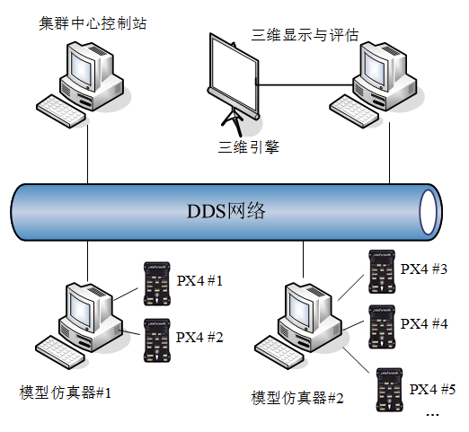

# 9.1、本章使用方法

RflySim采用分布式组网架构，不同的仿真模型可以运行在同一台电脑或者不同的电脑上。打开多个模型仿真器并连接多个Pixhawk/PX4自驾仪硬件就可以形成多无人集群的仿真环境。由于单台电脑的性能是有限的，可以通过局域网内多台电脑间进行相互通信的形式进一步扩展整体飞机数量。

## 本讲API文件
本讲开发相关API接口平台地址为：<a target="_blank" href="../RflySimAPIs/9.RflySimComm/API.pdf">🔗API🔗</a>
## 本讲PPT文件 
本讲内容的PPT文档的平台地址为：<a target="_blank" href="../RflySimAPIs/9.RflySimComm/PPT.pdf">🔗PPT🔗</a>
## 本讲所有例程文件
本讲所有例程请见Readme文档，该文件的平台地址为：<a target="_blank" href="../RflySimAPIs/9.RflySimComm/Readme.pdf">🔗Readme🔗</a>

| 序号 | 实验名称 | Readme | 最低版本 |
| ---- | ---- | ---- | ---- |
| 1 | DDS组网通信 | <a target="_blank" href="../RflySimAPIs/9.RflySimComm/0.ApiExps\1.DDS/Readme.pdf">Readme</a> | 免费版 |
| 2 | MAVlink通信实验 | <a target="_blank" href="../RflySimAPIs/9.RflySimComm/0.ApiExps\2.Mavlink/Readme.pdf">Readme</a> | 免费版 |
| 3 | Mqtt通信实验 | <a target="_blank" href="../RflySimAPIs/9.RflySimComm/0.ApiExps\3.MqttDemo/Readme.pdf">Readme</a> | 免费版 |
| 4 | 网络仿真模拟实验 | <a target="_blank" href="../RflySimAPIs/9.RflySimComm/0.ApiExps\4.NetSimMini_redis_nomat/Readme.pdf">Readme</a> | 免费版 |
| 5 | Redis通信模拟实验 | <a target="_blank" href="../RflySimAPIs/9.RflySimComm/0.ApiExps\5.RedisDemo/Readme.pdf">Readme</a> | 免费版 |
| 6 | 飞机组网实验 | <a target="_blank" href="../RflySimAPIs/9.RflySimComm/0.ApiExps\6.PythonNetSimAPI/Readme.pdf">Readme</a> | 免费版 |
| 7 | 飞机组网实验 | <a target="_blank" href="../RflySimAPIs/9.RflySimComm/1.BasicExps\e0-ResourcesFile/Readme.pdf">Readme</a> | 免费版 |
| 8 | 飞机组网实验 | <a target="_blank" href="../RflySimAPIs/9.RflySimComm/1.BasicExps\e1-Fast-DDS/Readme.pdf">Readme</a> | 免费版 |
| 9 | MQTT通信组网实验 | <a target="_blank" href="../RflySimAPIs/9.RflySimComm/1.BasicExps\e2-MQTT/Readme.pdf">Readme</a> | 免费版 |
| 10 | 飞机组网实验 | <a target="_blank" href="../RflySimAPIs/9.RflySimComm/1.BasicExps\e3-PythonNetSimAPI-CentCtrl/Readme.pdf">Readme</a> | 免费版 |
| 11 | 飞机组网实验 | <a target="_blank" href="../RflySimAPIs/9.RflySimComm/1.BasicExps\e4-PythonNetSimAPI-newest/Readme.pdf">Readme</a> | 免费版 |
| 12 | 飞机组网实验 | <a target="_blank" href="../RflySimAPIs/9.RflySimComm/1.BasicExps\e5-PythonNetSimAPI-SimpPack/Readme.pdf">Readme</a> | 免费版 |
| 13 | Redis飞机组网实验 | <a target="_blank" href="../RflySimAPIs/9.RflySimComm/1.BasicExps\e6-Redis/Readme.pdf">Readme</a> | 免费版 |
| 14 | 粗粒度集群组网实验 | <a target="_blank" href="../RflySimAPIs/9.RflySimComm/2.AdvExps\e0_AdvApiExps\1.NetSimMini_redis_nomat/Readme.pdf">Readme</a> | 个人版 |
| 15 | 粗粒度集群组网实验 | <a target="_blank" href="../RflySimAPIs/9.RflySimComm/2.AdvExps\e1-NetSim4Demo/Readme.pdf">Readme</a> | 集合版 |
| 16 | 粗粒度集群组网实验 | <a target="_blank" href="../RflySimAPIs/9.RflySimComm/2.AdvExps\e2-NetSimMini_redis_nomat/Readme.pdf">Readme</a> | 集合版 |
| 17 | 单机控制实验 | <a target="_blank" href="../RflySimAPIs/9.RflySimComm/2.AdvExps\e3-Python/Readme.pdf">Readme</a> | 集合版 |
| 18 | Redis网络组网信号质量检测实验 | <a target="_blank" href="../RflySimAPIs/9.RflySimComm/3.CustExps\e0-NetSimMini_redis_mat/Readme.pdf">Readme</a> | 完整版 |
