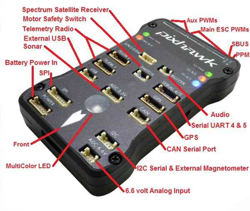

## 
 平台长期支持飞控介绍 

# 1.Pixhawk 2.4.8(又名Pixhawk 1)

Pixhaw2.4.8是一种先进的自动驾驶仪，由PX4开放硬件项目设计和3D机器人制造。它具有来自ST公司先进的处理器和传感器技术，以及NuttX实时操作系统，能够实现惊人的性能，灵活性和可靠性控制任何自主飞行器。其特点有：

1. 先进的32位ARM CortexM4高性能处理器，可运行NuttX RTOS实时操作系统。

2. 14个PWM/舵机输出(其中8个具有安全和手动控制功能，另外6个辅助，兼容高功率) ，外设丰富(UART,I2C,SPI,CAN) 。

3. 余度设计，集成备份电源和基本安全飞行控制器，主控制器失效时可安全切换到备份控制。

4. 备份系统集成混控功能，提供自动和手动混控模式。

5. 冗余电源输入和自动故障转移，外部安全按钮以容易启动电机。

6. 多色LED灯，高功率，多音蜂鸣器。

7. Micro SD,长时间高速率记录飞行数据。

如果使用的是Pixhawk 2.4.8 (2M flash) 的飞控硬件(对应固件为px4_fmu-v3)，推荐使用下图所示软件安装配置，和右下图所示硬件连接配置。

* 使用px4_fmu-v3_default编译命令。
* 使用“6”：PX4 1.12.3版本固件。
* 使用“1”：Win10WSL编译器。
* Pixhawk 1上自带LED灯，不需要外接模块，只需按右图连接遥控器接收机。

注： Pixhawk 2/3/4开始都不自带LED等模块， 需要购买外接LED模块 。
