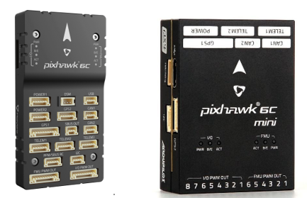
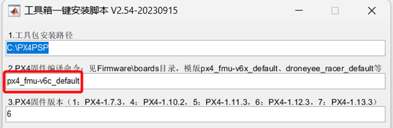

## 
 平台长期支持飞控介绍 

# Pixhawk 6C

Pixhawk 6C是基于Pixhawk FMUv6C开放标准和连接标准的成功无人机控制器家族的最新更新。它配备了PX4自动驾驶仪。在Pixhawk 6C内部，可以找到由STM制造的基于STM32H743的芯片，与来自Bosch和InvenSense的传感器技术配对，为任何自主车辆的控制提供灵活性和可靠性，适用于学术和商业应用。其特点有：

1. 高性能STM32H743处理器，具有更多的计算能力和内存容量；

2. 新的成本效益设计，采用低底盘尺寸；

3. 新设计的集成振动隔离系统，过滤高频振动并降低噪声，确保准确的读数；

4. 惯性测量单元（IMUs）由内置的加热电阻进行温度控制，确保IMUs的最佳工作温度。

如果使用的是Pixhawk 6C 的飞控硬件，推荐使用下图所示软件安装配置，硬件连接配置同Pixhawk 2.4.8相同。

* 使用px4_fmu-v6c_default编译命令。

* 使用“7”：PX4 1.13.3版本固件。

* 使用“1”：Win10WSL编译器。
