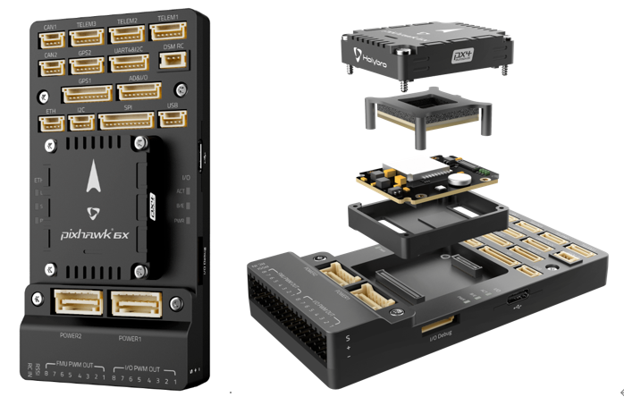
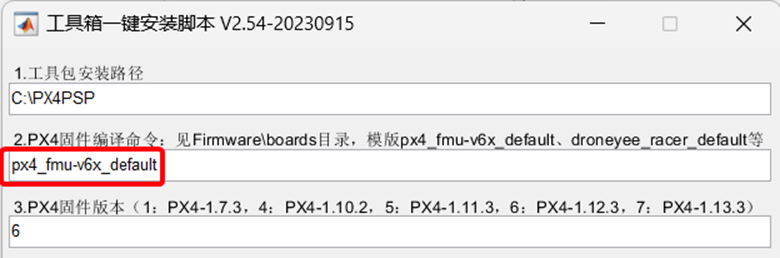

## 
 平台长期支持飞控介绍 

# Pixhawk 6X

在Pixhawk 6X内部，您可以找到由STM制造的基于STM32H753的芯片，与Bosch、InvenSense提供的传感器技术配对，为任何自主车辆的控制提供灵活性和可靠性，适用于学术和商业应用。Pixhawk 6X的H7微控制器包含运行最高达480MHz的Arm® Cortex®-M7核心，具有2MB闪存存储和1MB RAM。PX4自动驾驶仪利用了增强的处理能力和RAM。由于更新的处理能力，开发人员可以更加高效和生产力，使他们的开发工作变得更加复杂和模型。FMUv6X开放标准包括内置的高性能、低噪声惯性测量单元（IMU），旨在提高稳定性。独立的LDO为每个传感器组供电，具有独立的电源控制。一种过滤高频振动并降低噪声的振动隔离系统，以确保准确的读数，使车辆能够实现更好的总体飞行性能。外部传感器总线（SPI5）具有两个芯片选择线和数据就绪信号，用于与SPI接口连接的附加传感器和载荷，并配有内置的微芯片以太网PHY，可以通过以太网实现高速通信。Pixhawk 6X完美适用于企业研究实验室、初创企业、学术研究（包括教授、研究生和学生）以及商业应用。其特点有：

1. 高性能STM32H753处理器；

2. 可拆卸的飞控板：独立的IMU、FMU和基础系统通过100个Pin和50个Pin Pixhawk自动驾驶仪总线连接器相连。

3. 冗余：在各自的总线上具有三倍IMU传感器和双倍气压传感器。

4. 三倍冗余区域：具有各自的总线和各自的电源控制的完全隔离的传感器区域。

5. 新设计的振动隔离系统过滤高频振动和减少噪声，以确保准确的读数。

6. 以太网接口用于高速任务计算机集成。

7. 惯性测量单元由内置的加热电阻进行温度控制，以确保IMU的最佳工作温度。

   

如果使用的是Pixhawk 6X 的飞控硬件，推荐使用下图所示软件安装配置，硬件连接配置同Pixhawk 2.4.8相同。

 

* 使用px4_fmu-v6c_default编译命令。
* 使用“7”：PX4 1.13.3版本固件。
* 使用“1”：Win10WSL编译器。