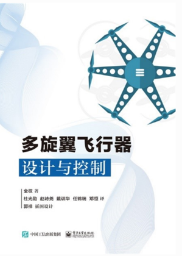

# 《多旋翼飞行器设计与控制》

本书讲授多旋翼设计、动态模型建立、状态估计、控制和决策等方面的基础知识。涉及到空气流体力学、电机、电路、材料结构、理论力学、以及导航、制导与控制各个学科的基础知识，具有基础性和系统性两个特色。因此，有利于读者将已学知识融会贯通，着重培养学生解决问题的综合能力。本书覆盖了多旋翼飞行器设计的大部分内容，共十五章，包括多旋翼飞行器基础知识、布局、动力系统、建模、感知、控制和决策等部分。旨在将多旋翼飞行器工程实践中应用的设计原则组织起来，并强调基础概念的重要性，具有基础性、实用性、综合性和系统性等特点。本书可以用作高年级本科生以及研究生教材，或者作为该领域研究的入门指南，还可以作为多旋翼飞行器工程师的自学教材。另外，本书也可以作为其他无人飞行系统乃至无人系统的补充阅读材料。书籍购买链接：[点这里](https://item.jd.com/12322312.html) ，在线视频课程学习网站：[点这里](http://rfly.buaa.edu.cn/course.html)。

| 目录                              | 课件    |
| --------------------------------- | ------- |
| 第01讲_绪论                       | <a target="_blank" href="./BookPPT/1.Multicopter_Design/第01讲_绪论V2.pdf">Readme</a> |
| 第02讲_基本组成                   | <a target="_blank" href="./BookPPT/1.Multicopter_Design/第02讲_基本组成V2.pdf">Readme</a>     |
| 第03讲_机架设计                   | <a target="_blank" href="./BookPPT/1.Multicopter_Design/第03讲_机架设计V2.1.pdf">Readme</a>     |
| 第04讲_动力系统建模和估算         | <a target="_blank" href="./BookPPT/1.Multicopter_Design/第04讲_动力系统建模和估算V2.pdf">Readme</a>     |
| 第05讲_坐标系和姿态表示           | <a target="_blank" href="./BookPPT/1.Multicopter_Design/第05讲_坐标系和姿态表示V2.pdf">Readme</a>     |
| 第06讲_动态模型和参数测量         | <a target="_blank" href="./BookPPT/1.Multicopter_Design/第06讲_动态模型和参数测量V2.pdf">Readme</a>     |
| 第07讲_传感器标定和测量模型       | <a target="_blank" href="./BookPPT/1.Multicopter_Design/第07讲_传感器标定和测量模型V2.pdf">Readme</a>     |
| 第08讲_可观性和卡尔曼滤波器       | <a target="_blank" href="./BookPPT/1.Multicopter_Design/第08讲_可观性和卡尔曼滤波器V2.pdf">Readme</a>     |
| 第09讲_状态估计                   | <a target="_blank" href="./BookPPT/1.Multicopter_Design/第09讲_状态估计V2.pdf">Readme</a>     |
| 第10讲_稳定性和可控性             | <a target="_blank" href="./BookPPT/1.Multicopter_Design/第10讲_稳定性和可控性V2.pdf">Readme</a>     |
| 第11讲_底层飞行控制               | <a target="_blank" href="./BookPPT/1.Multicopter_Design/第11讲_底层飞行控制V2.pdf">Readme</a>     |
| 第12讲_基于半自主自驾仪的位置控制 | <a target="_blank" href="./BookPPT/1.Multicopter_Design/第12讲_基于半自主自驾仪的位置控制V2.pdf">Readme</a>     |
| 第13讲_任务决策                   | <a target="_blank" href="./BookPPT/1.Multicopter_Design/第13讲_任务决策V2.pdf">Readme</a>     |
| 第14讲_健康评估和失效保护         | <a target="_blank" href="./BookPPT/1.Multicopter_Design/第14讲_健康评估和失效保护V2.pdf">Readme</a>     |
| 第15讲_展望                       | <a target="_blank" href="./BookPPT/1.Multicopter_Design/第15讲_展望V2.pdf">Readme</a>     |

