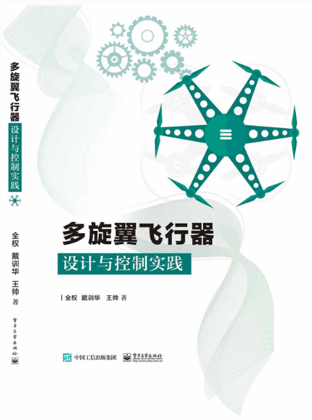

# 《多旋翼飞行器设计与控制实践》

本书分为实验平台和实验任务两大部分，其中实验平台依托为本书特别设计的RflySim平台。RflySim平台利用目前的先进开发理念“基于模型开发（Model-Based Design）”流程，将多旋翼飞行器、Pixhawk自驾仪，以及MATLAB Simulink编程语言紧密联系在一起。实验任务共包括循序渐进的8个实验：动力系统设计、动态建模、传感器标定、滤波器设计、姿态控制器设计、定点位置控制器设计、半自主控制模式设计及失效保护逻辑设计，完成多旋翼飞行器设计与控制实践。本书适合对无人机特别是多旋翼飞行器设计与控制感兴趣的读者，也可以把本书部分实验作为专业课程的实践环节。书籍购买链接：[点这里](https://item.jd.com/12920412.html)，在线视频课程学习网站：[点这里](https://www.bilibili.com/video/BV1wA411T7Vu/?spm_id_from=333.999.0.0&vd_source=3c57bec9aafbb3c903a990061af71ac4)

| 目录                                  | 课件    |
| ------------------------------------- | ------- |
| 第01讲_课程介绍                       | <a target="_blank" href="./BookPPT/2.Multicopter_Practice/e0-PlatformStudy/1.pdf">Readme</a> |
| 第02讲_实验平台配置                   | <a target="_blank" href="./BookPPT/2.Multicopter_Practice/e0-PlatformStudy/2.pdf">Readme</a> |
| 第03讲_实验平台使用                   | <a target="_blank" href="./BookPPT/2.Multicopter_Practice/e0-PlatformStudy/3.pdf">Readme</a> |
| 第04讲_实验流程介绍                   | <a target="_blank" href="./BookPPT/2.Multicopter_Practice/e0-PlatformStudy/4.pdf">Readme</a> |
| 第05讲_ 实验一_动力系统设计实验       | <a target="_blank" href="./BookPPT/2.Multicopter_Practice/e1-FlightEval/5.pdf">Readme</a> |
| 第06讲_ 实验二_动态建模实验           | <a target="_blank" href="./BookPPT/2.Multicopter_Practice/e2-UavModeling/6.pdf">Readme</a> |
| 第07讲_ 实验三_传感器标定实验         | <a target="_blank" href="./BookPPT/2.Multicopter_Practice/e3-SensorCalib/7.pdf">Readme</a> |
| 第08讲_ 实验四_滤波器设计实验         | <a target="_blank" href="./BookPPT/2.Multicopter_Practice/e4-FilterDesign/8.pdf">Readme</a> |
| 第09讲_ 实验五_姿态控制器设计实验     | <a target="_blank" href="./BookPPT/2.Multicopter_Practice/e5-AttitudeCtrl/9.pdf">Readme</a> |
| 第10讲_ 实验六_定点位置控制器设计实验 | <a target="_blank" href="./BookPPT/2.Multicopter_Practice/e6-PositionCtrl/10.pdf">Readme</a> |
| 第11讲_ 实验七_半自主控制模式设计实验 | <a target="_blank" href="./BookPPT/2.Multicopter_Practice/e7-SemiAutoCtrl/11.pdf">Readme</a> |
| 第12讲_ 实验八_失效保护逻辑设计实验   | <a target="_blank" href="./BookPPT/2.Multicopter_Practice/e8-FailsafeLogic/12.pdf">Readme</a> |

