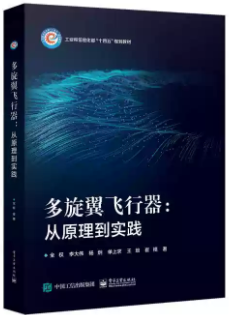

# 《多旋翼飞行器从原理到实践》

本书是多旋翼飞行器的一本入门级教材，也是一本从原理到操作实践的手册。它首先介绍了多旋翼飞行器的基本概念、飞行原理、发展历史等内容；然后，对其系统组成以及机架、动力系统、通信系统、 飞行控制系统等重要组成部分进行了详细介绍；最后，介绍了组装调试、操控和维护、行业应用和发展等知识。总得来说，本书做到了理论讲解和实践操作的有机融合，做到了内容的全面与细致，也在处处讲解安全操作，培养读者的安全意识。我们也为本书配备了大量教学和实践操作视频，帮助读者更好地学习和掌握本书内容。书籍购买链接：[点这里](https://www.taobao.com/list/item/719850104834.htm#:~:text=%E6%9C%AC%E4%B9%A6%E7%9E%84%E5%87%86%E5%A4%9A%E6%97%8B%E7%BF%BC%E6%97%A0,%E7%BB%BC%E5%90%88%E5%8F%82%E8%80%83%E6%95%99%E7%A7%91%E4%B9%A6%E3%80%82)，在线视频课程学习网站：[点这里](https://space.bilibili.com/1708004959/channel/collectiondetail?sid=1611270)。

| 目录                       | 课件                                                         |
| -------------------------- | ------------------------------------------------------------ |
| 第1章 绪论                 | <a target="_blank" href="./BookPPT/3.Multicopter_PrincipleToPractice/第1章 绪论.pdf">Readme</a>                                                             |
| 第2章 系统基本组成         | <a target="_blank" href="./BookPPT/3.Multicopter_PrincipleToPractice/第2章 系统基本组成.pdf">Readme</a> |
| 第3章 机架设计和参数测量   | <a target="_blank" href="./BookPPT/3.Multicopter_PrincipleToPractice/第3章 机架设计和参数测量.pdf">Readme</a> |
| 第4章 动力系统配置和设计   | <a target="_blank" href="./BookPPT/3.Multicopter_PrincipleToPractice/第4章 动力系统配置和设计.pdf">Readme</a> |
| 第5章 通信系统配置和测试   | <a target="_blank" href="./BookPPT/3.Multicopter_PrincipleToPractice/第5章 通信系统配置和测试.pdf">Readme</a> |
| 第6章_自驾仪标定和调试     | <a target="_blank" href="./BookPPT/3.Multicopter_PrincipleToPractice/第6章_自驾仪标定和调试.pdf">Readme</a> |
| 第7章_组装和位置控制调试   | <a target="_blank" href="./BookPPT/3.Multicopter_PrincipleToPractice/第7章_组装和位置控制调试.pdf">Readme</a> |
| 第8章 多旋翼飞行操控与维护 | <a target="_blank" href="./BookPPT/3.Multicopter_PrincipleToPractice/第8章 多旋翼飞行操控与维护.pdf">Readme</a> |
| 第9章 展望                 | <a target="_blank" href="./BookPPT/3.Multicopter_PrincipleToPractice/第9章 展望.pdf">Readme</a> |

