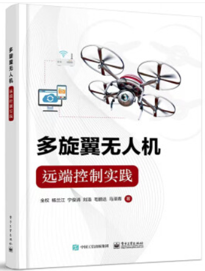

# 《多旋翼飞行器远端控制实践》

本书瞄准多旋翼无人机的应用实践，旨在降低入门门槛，为更多不具备多旋翼专业知识和开发背景的高职、低年级本科生或相关从业人员提供理论实践相结合的综合参考教科书，让读者在学习\"自动控制原理”等专业课之后，运用所学专业技术基础课及专业课知识，进行控制系统的详细设计，使读者在综合运用专业理论解决工程问题方面得到实际锻炼。书籍购买链接：[点这里](https://item.jd.com/10069606247446.html)，在线视频课程学习网站：[点这里](https://space.bilibili.com/1575504779/channel/seriesdetail?sid=2039848)。

| 目录                         | 课件                                                         |
| ---------------------------- | ------------------------------------------------------------ |
| 第1章-绪论                   | <a target="_blank" href="./BookPPT/4.Multicopter_RemoteControl/第1章-绪论.pdf">Readme</a> |
| 第2&3章-实验平台和实验流程   | <a target="_blank" href="./BookPPT/4.Multicopter_RemoteControl/第2&3章-实验平台和实验流程.pdf">Readme</a> |
| 第4章-系统辨识实验           | <a target="_blank" href="./BookPPT/4.Multicopter_RemoteControl/第4章-系统辨识实验.pdf">Readme</a> |
| 第5章-滤波器设计实验         | <a target="_blank" href="./BookPPT/4.Multicopter_RemoteControl/第5章-滤波器设计实验.pdf">Readme</a> |
| 第6章-跟踪控制器设计实验     | <a target="_blank" href="./BookPPT/4.Multicopter_RemoteControl/第6章-跟踪控制器设计实验.pdf">Readme</a> |
| 第7章-路径跟随控制器设计实验 | <a target="_blank" href="./BookPPT/4.Multicopter_RemoteControl/第7章-路径跟随控制器设计实验.pdf">Readme</a> |
| 第8章-避障控制器设计实验     | <a target="_blank" href="./BookPPT/4.Multicopter_RemoteControl/第8章-避障控制器设计实验.pdf">Readme</a> |

