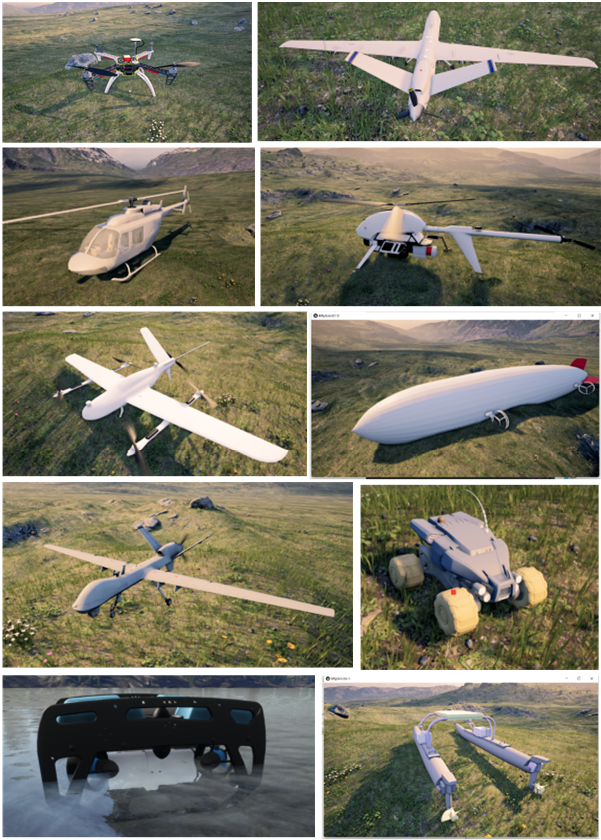

# 1. RflySim是什么？

RflySim是由北航可靠飞行控制组发布的生态系统或工具链。它由全权教授指导，戴训华博士主导开发，后经卓翼智能旗下的飞思实验室接管和推动高级功能的开发，专为无人平台控制系统开发、大规模集群协同、人工智能视觉等前沿研究领域研发的一套高可信度的无人控制系统开发、测试与评估平台。该平台采用基于模型（MBD）的设计理念，基于Pixhawk/PX4、MATLAB/Simulink和ROS等以及货架智能硬件等，可开展(不限于)：无人智能体控制的仿真与实飞/运动，无人智能体集群的仿真与实飞/运动，以及基于无人智能体视觉的仿真与实飞/运动。针对上述问题的研究时，可以开展无人系统建模、控制器设计、软件在环仿真（Software-In-the-Loop，SIL）、硬件在环仿真（Hardware-In-the-Loop，HIL），通过MATLAB/Simulink的自动代码生成技术，控制器能够被方便地自动下载到硬件中，用于HIL仿真和实际飞行测试，实现Sim2Real。<a target="_blank" href="https://rflysim.com">🔗详情见链接🔗</a>

# 2. 配套教材

|            教材名称            |                           购买链接                           |                           视频课程                           | 配套资源                                       |
| :----------------------------: | :----------------------------------------------------------: | :----------------------------------------------------------: | ---------------------------------------------- |
|   《多旋翼飞行器设计与控制》   | [多旋翼飞行器设计与控制](https://item.jd.com/12322312.html)  |         [URL](http://rfly.buaa.edu.cn/course.html )          | [PDF](/C/1.Multicopter_Design.md)              |
| 《多旋翼飞行器设计与控制实践》 | [多旋翼飞行器设计与控制实践](https://item.jd.com/12920412.html) | [URL](https://www.bilibili.com/video/BV1wA411T7Vu/?spm_id_from=333.999.0.0&vd_source=3c57bec9aafbb3c903a990061af71ac4) | [PDF](/C/2.Multicopter_Practice.md)            |
| 《多旋翼飞行器:从原理到实践》  | [多旋翼飞行器:从原理到实践](https://item.jd.com/10076504226851.html) | [URL](https://space.bilibili.com/1708004959/channel/collectiondetail?sid=1611270) | [PDF](/C/3.Multicopter_PrincipleToPractice.md) |
|  《多旋翼无人机远程控制实践》  | [多旋翼无人机远程控制实践](https://item.jd.com/10069606247446.html) | [URL](https://space.bilibili.com/1575504779/channel/seriesdetail?sid=2039848) | [PDF](/C/4.Multicopter_RemoteControl.md)       |

# 3. 版本划分

RflySim平台目前分为了三个版本：**免费版、完整版、企业定制版**，请咨询 service@rflysim.com）。

* **免费版**：最多支持8个飞机（8个飞机的软硬件在环仿真）；支持1个飞机的视觉板卡在环仿真。注：当CopterSim的CopterID为1时，可开启局域网通信模式，支持与虚拟机或NX板卡，实现视觉在环仿真；带直升机、垂起飞机、水下潜航器等DLL动态模型，能够进行任务级别的软硬件在环仿真，但是不提供模型源码。不支持联机按钮，无法向局域网发送消息。只能单电脑仿真，不支持分布式多电脑组网，形成大规模集群仿真。不支持HITL_NET等高级仿真模式，无法连接局域网中的带网口的Pixhawk（例如，6x），或第三方飞控进行硬件在环仿真。
* **完整版：** 保留RflySim全部功能，RflySim3D支持接收局域网数据（默认关闭，选择性开启），支持生成红外图像，CopterSim支持联机模式（UDP方式，小规模分布式仿真）不支持Redis通信协议，不支持RflySimCloud大规模集群框架（用于大规模分布式集群仿真）不支持LOGO替换或屏蔽（用于企业定制）带基于UDP的分布式视觉集群仿真例程、数字孪生例程等。
* **企业定制版：** CopterSim和RflySim3D支持隐藏或自定义LOGO；支持多电脑分布式组网构架大规模集群仿真；支持Redis通信协议（用于大规模分布式集群仿真）。带定制化的大型进阶例程（直升机、倾转旋翼、多机集群实验等）；支持Windows高性能电脑，或Linux服务器进行部署（RflySimCloud云平台）；基于FPGA的超高实时硬件在环仿真平台（支持Ardupilot等飞控）。

各个版本之间的更多区别请见：<a target="_blank" href="./RflysimVersions.pdf">🔗版本区别🔗</a>

# 4. 特色功能

RflySim平台高级版及定制版其具有如下特点：

* **统一性**。整个研究框架扩展到所有的无人控制系统，形成一个标准的自动开发、测试与评估框架体系；

  

* **无人机物理特性仿真还原度高**。其开发者均为无人机研究团队，具有丰富的无人机领域研究经验；

* **易用性**。在Windows平台下进行一键安装、一键代码生成、一键固件部署、一键软硬件在环仿真和快速实飞, 非常方便易用。用户不需要了解飞控源码、Linux编程、C/C++编程、网络通信、飞机组装等底层知识，只需具备基础的Simulink（或Python）知识，即可快速将自己的算法经过层层验证并应用于真机上，有助于更专注于算法的开发与测试。

* **完全分布式构架**。所有应用软件都可以在同一台或多台电脑上多开，并且各个应用之间可以通过UDP网络相互收发消息，这种分布式的构架非常适合于大规模带视觉的无人机集群仿真测试；

  

* **支持多种机型仿真**。支持小车、固定翼、垂直起降飞行器（VTOL）等多种机型。用户可以在Simulink中根据规范的接口搭建机架模型，然后自动生成DLL文件用于HIL仿真。进一步实验平台能被拓展到任意无人系统中；

  

* **支持大规模无人机集群SIL/HIL仿真**。在同一局域网下，开发者可以使用CopterSim连接多个Pixhawk进行硬件或软件在环仿真。同时，还可以使用Simulink或者C++程序控制飞行器，控制指令会由Mavlink协议经过串口（数传）或者网络（WIFI）发送给Pixhawk；

  

* **提供高逼真的3D视景**。提供源码和教程帮助开发者在虚幻（Unreal Engine，UE）中搭建高度逼真的3D场景，用于室内外环境仿真或者基于视觉算法的开发；场景支持物理碰撞引擎，全球地形和地图，OSGB+Cesium倾斜摄影视景地图导入，自定义GPS坐标，任意多窗口切换观察，RGB、深度、灰度、IMU、激光雷达等传感器数据输出，支持共享内存或者UDP图片直发指定IP地址，可用于机载计算机硬件在环SLAM仿真。

  

* **支持基于视觉的控制**。基于UE的三维视景平台还支持视角切换功能，可以获取方便地获取到多个视角的图像数据。还支持通过共享内存的方式在Simulink、Python、C/C++等代码平台中实时获取到图像数据并进行处理，处理得到的视觉数据可以通过UDP再返回给CopterSim或者Simulink控制，形成带有视觉的硬件在环仿真闭环。

  

* **支持多种故障注入**。可实现的故障类型包括模型故障、通信故障和环境故障等。

