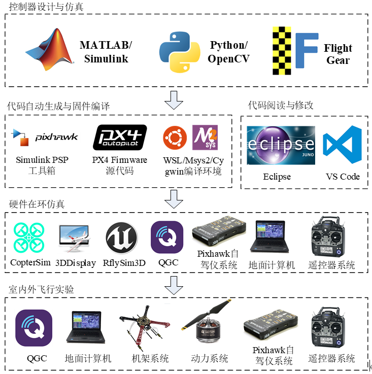
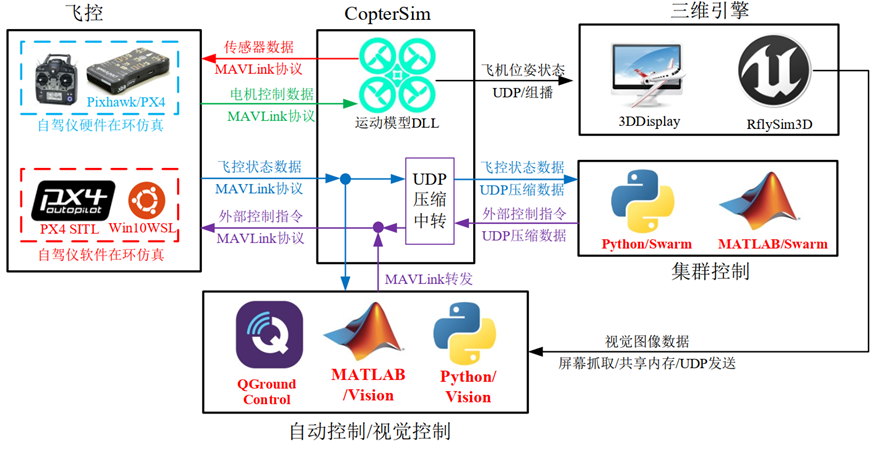
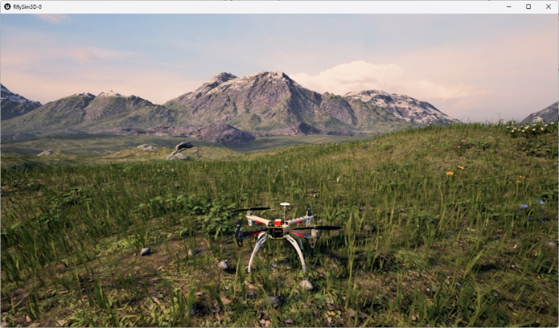
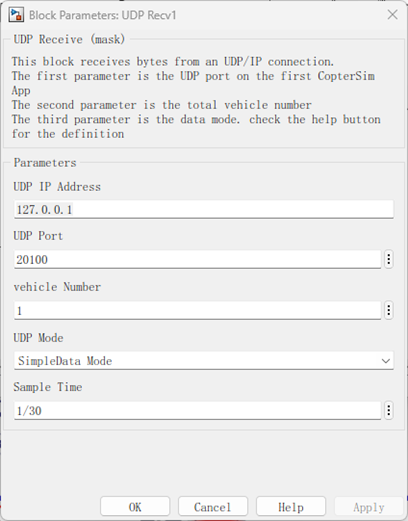

# RflySim平台核心组件介绍

RflySim平台包含了众多在进行无人系统建模、仿真、算法验证等开发过程中所涉及到的软件，其中，核心组件有CopterSim、QGroundControl、RflySim3D/RflySimUE5、Python38Env、Win10WSL子系统、SITL/HITLRun一键运行脚本、MATLAB自动代码生成工具箱、Simulink集群控制接口、PX4 Firmware源码、RflySim配套资料文件以及配套硬件系统。用户通过对这些核心组件的学习即可快速上手无人系统的开发和测试工作。

## 1、CopterSim

CopterSim是RflySim平台核心软件之一，它是针对Pixhawk/PX4自驾仪平台开发的一款硬件在环仿真软件，可以在软件中配置多旋翼的模型，通过USB串口与Pixhawk自驾仪连接来实现硬件在环仿真，达到室内模拟室外飞行测试的效果。主要由两大部分组成—模型和通信。模型是指可根据所设置的模型参数，进行计算后直接就可进行仿真；并支持运行动态模型(DLL)，并连同其他软件构成软/硬件在环仿真。CopterSim是所有数据通信的中心；飞控与CopterSim通过串口（硬件在环HITL）或网络TCP/UDP（软件在环SITL）进行连接，使用MAVLink进行数据传输，实现控制闭环，模拟室外飞行情形；CopterSim发送飞机位姿、电机数据到三维引擎，实现可视化展示；转发MAVLink消息到Python视觉或QGC地面站，传输飞机实时状态，实现顶层规划控制；等等。同时，CopterSim软件对MAVLink数据进行压缩后以UDP结构体形式发给集群控制软件，达到通信精简目的（大规模集群需求）。

## 2、RflySim3D/RflySimUE5

Unreal Engine具有强大的图形引擎，支持高品质的3D图形和视觉效果；内置的蓝图可视化脚本系统，使得开发者可以使用图形化的方式来创建复杂的逻辑和交互行为，而无需编写代码；拥有庞大的社区支持和资源库，包括模型、纹理、音效、插件等等，这些资源可以帮助开发者加快开发进程和提高模型品质；支持多个平台，包括PC、主机、移动设备和虚拟现实设备等等；开发者可以根据自己的需求来自定义和扩展引擎的功能和工具，使得Unreal Engine适用于各种类型的游戏和应用程序开发。

RflySim3D/RflySimUE5是基于Unreal Engine引擎开发的无人系统高逼真仿真软件，继承了Unreal Engine引擎的各种优势，通过UDP的形式与平台其他软件进行通信，实现高逼真的无人系统仿真，同时，可通过屏幕抓取、共享内存等方式将视觉图像数据传输都QGroundControl、MATLAB、Python等软件，实现无人系统的视觉算法验证仿真，

同时，针对电脑配置较低的用户，RflySim平台提供另两种三维仿真软件，分别为：FlightGear和3DDisplay。FlightGear的开发团队来自世界各地，包括程序员、飞行员、物理学家和飞机制造商等领域的专家，提供了多种不同类型的飞机模型和场景，包括各种民用和军用飞机模型，以及多种不同的场景和环境模拟。它是一款非常受欢迎的开源飞行模拟器软件，可以通过UDP接收Simulink发送的飞行状态，方便地观测Simulink仿真时飞机的飞行状态。3DDisplay是由北航可靠飞行控制研究组开发的虚拟飞行模拟器软件，提供了三维模型和虚拟环境，支持多种飞机模型和场景。用户可根据个人电脑的配置情况，自由切换RflySim3D/RflySimUE5、FlightGear、3DDisplay三款仿真软件。

## 3、QGroundControl地面站

无人机地面站是无人机应用控制系统的关键组成部分，操作员可以通过鼠标、触摸屏、遥控手柄操作地面站以达到控制无人机的目的，并且通过在地面站上设定航点信息以及规划航线，可以使无人机按照预设的路径飞行，并在飞行途中完成航点任务，包括拍照，飞机动作，录像等。目前主流开源地面站为 QGroundControl 和 MissionPlanner，而QGroundControl是专为 PX 4软件最新架构的开源地面站，其使用 QT 编辑器 C++语言编写其核心代码，其支持源代码修改和功能二次开发，即适合无人机地面站研究实验也适合无人机地面站功能的定制及修改。相比来说QGroundControl的优势有：

1）开源性：QGroundControl是一个完全开源的软件，这意味着用户可以根据需要自由修改和定制它。

2）易于性：用户界面非常清晰、现代化和易于使用，使用户可以快速进行任务规划和飞行计划。

3）多平台支持：QGroundControl可在多种操作系统上运行，如Windows、Linux和MacOS等。

4）模块化架构：QGroundControl的模块化架构使得开发人员可以轻松地添加和扩展新功能，而不会影响到现有的功能和性能。

总体而言，QGroundControl是一个现代化、易于使用、开源且高度可定制的地面站软件，它在多平台支持、多语言支持、模块化架构等方面具有明显的优势。

## 4、Python38Env

Python是一种高级的、面向对象的解释型编程语言。它最初由Guido van Rossum于1989年创建，现在已经成为一种流行的编程语言，用于开发Web应用程序、数据分析、人工智能、科学计算、网络编程等等。Python是一种简单易学、易读、易编写的语言，因此也被广泛用于教学和入门级编程。

Python38Env是一个Python 3.8的编程语言的虚拟环境，包含了numpy、pymavlink、OpenCV、pyulog等库，可快速进行无人系统的相关算法开发，无需用户部署python运行环境和各种功能库。

## 5、MATLAB自动代码生成工具箱

MATLAB自动代码生成工具箱是一个MATLAB的扩展工具包，用于从Simulink模型中生成C代码、可执行文件、静态库和动态库等各种形式的可执行文件。这些可执行文件可以直接在嵌入式平台上运行，而不需要进行手动编写和调试。支持多种嵌入式平台，包括ARM Cortex-M和A系列处理器、NXP MPC55xx和MPC56xx系列、Pixhawk系列等。

该模块库中包含GPS数据模块、电池数据模块、uORB模块等众多模块。基于RflySim和Pixhawk Support Package平台，用户可实现：① 在Simulink中设计和模拟控制算法；② 从Simulink模型自动生成C代码和PX4固件，并将其直接烧录到Pixhawk板上；③ 使用MATLAB脚本和函数配置和校准Pixhawk板及其外围设备；④ 实时读写与Pixhawk板的数据等等。

## 6、SITL/HITL批处理脚本

批处理技术是指计算机可分组处理收集到的若干任务，整个过程完全自动化，无需人工干预，这也可以称为工作负载自动化 (WLA) 和作业调度。它具有速度和成本节约、准确性、操作简单等优点。

RflySim基于批处理技术开发了众多批处理脚本，让用户可以快速一键启动部署多架、多种、多样无人系统组合式仿真。提高了无人系统开发和仿真速度。平台较常用的批处理脚本：① SITLRun.bat：是开启多机软件在环仿真的批处理文件，其本质上是通过脚本方式启动并配置RflySim平台的部分软件和选项，② HITLRun.bat：是开启多机硬件在环仿真的批处理文件，插入多个飞控之后，再双击该批处理文件，根据提示输入想要参与仿真的Pixhawk串口号，即可开启多机的硬件在环仿真（以输入串口顺序进行飞机ID排序）。除此之外RflySim平台还提供众多批处理脚本文件，如：SITLRunPos.bat、SITLRunLowGPU.bat、SITLRunMAVLink.bat、HITLRunPos.bat、HITLPosSysID.bat、HITLPosStr.bat等等。用户可通过编辑器打开这些文件，根据个人需求修改其中的参数，实现自定义开发，快速开始仿真或算法的验证。

## 7、PX4 Firmware源码

PX4由瑞士苏黎世联邦理工学院(ETH)计算机视觉与几何实验室的一个软硬件项目PIXHAWK演变而来，该飞控系统完全开源，为全球各地的飞控爱好者和研究团队提供一款低成本高性能的高端自驾仪。经过来自工业界和学术界的世界级开发人员多年的开发与完善，目前PX4飞控系统已经形成完善合理的软件架构，配合Pixhawk系列自驾仪硬件平台上，构成了Pixhawk PX4自驾仪软硬件平台，可控制多旋翼、固定翼、飞艇等多种载具，是目前世界范围内广泛应用的开源无人机自驾仪软硬件平台。

RflySim平台支持一键部署PX4编译环境，可自定义选择不同的PX4固件编译命令和固件版本，平台会将选定的PX4 Firmware源代码部署在设定的安装路径上，如果固件存在，会删除旧的固件文件夹，并进行全新部署，极大的提高了PX4环境部署的效率。

## 8、Win10WSL子系统

Win10WSL子系统是一种Windows操作系统上的子系统，用户可在Windows系统中运行Linux应用程序，使用Linux命令行界面（CLI）并安装Linux发行版，RflySim平台一键安装的Linux系统为Ubuntu18.04.5，主要是用于PX4源代码的编译，

本平台还提供另两套编译环境来实现Windows平台下对Linux编译环境的模拟，分别是：基于Msys2 的Msys2Toolchain编译环境和基于Cygwin的CygwinToolchain编译器。用户可根据自己的PX4版本选择不同的编译环境，且在一键部署安装界面不同的选择即可完成不同编译环境的切换。

## 9、Simulink集群控制接口

RflySim平台基于Simulink S函数开发了集群控制接口，该接口是通过Simulink S函数通过C++混编实现，配合Simulink自带的UDP模块优点，具有效率高、运算小、延迟低、更可靠、扩展性强等优点。用户可通过复制粘贴的方式，将该模块加载到自己的控制系统中，帮助用户快速实现无人系统集群控制开发。

## 10、RflySim配套资料文件

RflySim平台提供非常完善的学习资料及例程文件，通过PPT课件资料和RflySimAPIs例程文件，使用户循序通过渐进、层层递进的学习方式，从无人系统底层控制算法→中层决策算法→顶层学习算法的开发与验证，一站式搭建、开发出自己所需的无人系统。

## 11、配套硬件系统

RflySim平台提供了一套完整的配套硬件系统，包括四旋翼无人机、飞控、遥控器等组件。这些组件均能与平台完美兼容，可以在RflySim平台中是实现软、硬件在环仿真实验，基于生成的固件实现无人机在真实环境下的飞行。

目前支持的飞机有飞思X150、飞思X200、飞思X450等四旋翼无人机，其中飞思X150为室内集群控制科研全新设计的微型四旋翼无人机，由于RflySim平台是基于PX4软件系统开发而成，正常情况下，只要支持PX4软件系统的飞控均可在RflySim平台上使用。目前长期支持的飞控Pixhawk 2.4.8(又名Pixhawk 1)、Pixhawk 6C、Pixhawk 6X。本平台使用的遥控器推荐使用“美国手”的操纵方式，即左侧摇杆对应的油门与偏航控制量，而右侧摇杆对应滚转与俯仰。遥控器中滚转、俯仰、油门和偏航分别对应了接收机的CH1~CH4通道，左右上侧拨杆对应了CH5/CH6号通道，用于触发飞行模态切换。支持的遥控器品牌型号有乐迪AT9S Pro、天地飞ET10、福斯i6s、Futuba T14SG等等。

